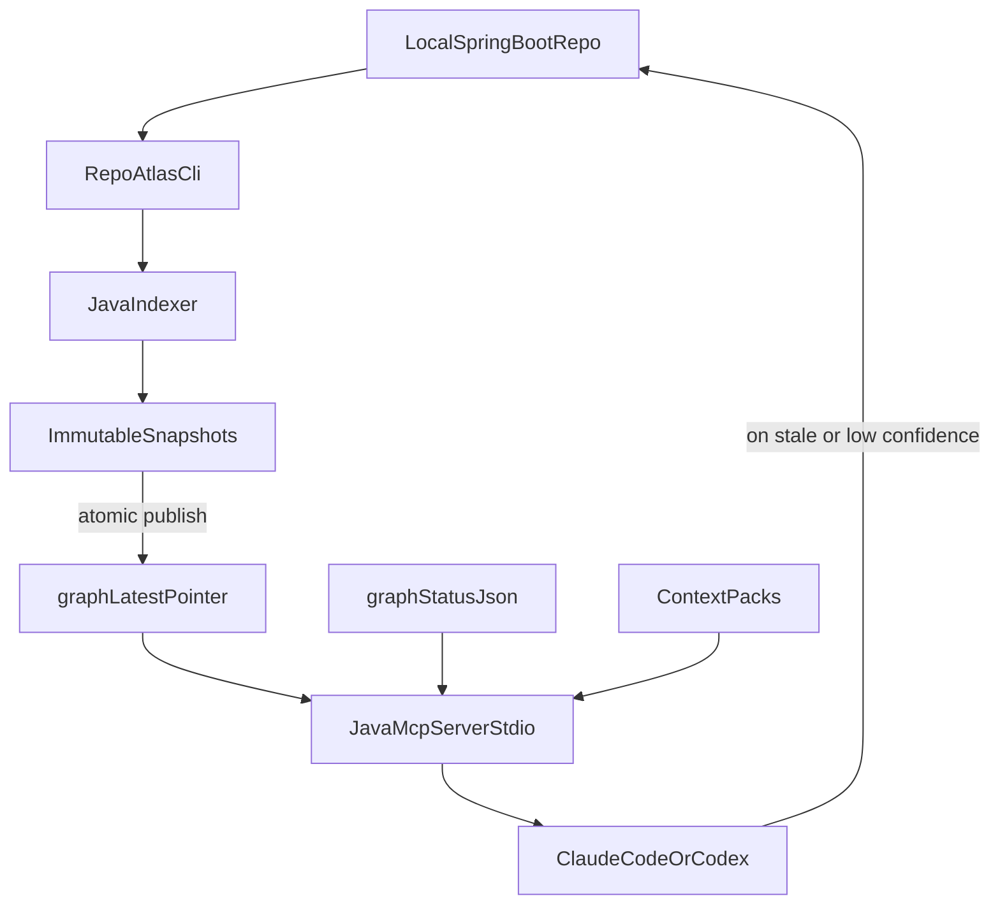

# RepoAtlas: A Local Deterministic Code Intelligence and Reuse Graph for Java/Spring Systems

---

## 0. Document Conventions

- **Snapshot** refers to an immutable SQLite file representing one full or incremental build of the graph.
- **Pointer** refers to `graph_latest.pointer`, a small file naming the currently active snapshot.
- **Pack** refers to a task-scoped context pack pinned to a snapshot.
- **Capability** refers to a `BusinessCapability` node, distinct from any HTTP endpoint or path.
- **Live source** always refers to the current bytes on disk in the developer working tree.
- **Confidence** is a controlled vocabulary: `high`, `medium`, `low`. There are no other tiers.
- **Authoritative** means: when this rule conflicts with another section, this rule wins.

---

## 1. Executive Summary

### 1.1 Problem Statement

Modern AI coding assistants are powerful enough to navigate large repositories on demand, but they pay for that power in three ways. They re-explore the same code repeatedly across sessions and tasks. They infer architectural relationships from local lexical evidence, missing semantics that are obvious to compilers. And they sometimes produce confident, plausible answers that do not match the actual structure of the system, especially in services where transport-level evidence is a poor proxy for business meaning.

These costs are absorbed silently in many environments. They become unacceptable when the system in question is a Java Spring Boot service composed of dozens of internal client libraries, layered architecture rules, OpenAPI contracts, and platform service capabilities. In that environment, repeated exploration is expensive, undirected exploration is unsafe, and confident-sounding hallucinations are dangerous.

### 1.2 Thesis

RepoAtlas is a deterministic local code intelligence and reuse graph for Java Spring Boot systems. Its purpose is not to chat with the repository. Its purpose is to provide an agent with a precise, trustworthy, snapshot-based map before the agent reads source. When the map is fresh, RepoAtlas reduces exploration. When the map is stale, RepoAtlas routes the agent to the exact source files that must be read directly. When the graph cannot prove something, RepoAtlas says so.

### 1.3 Non-Goals

- RepoAtlas is not a multi-language tool in MVP. It is Java + Spring Boot + Gradle + OpenAPI.
- RepoAtlas is not a generic "ask anything" RAG layer. It exposes task-oriented MCP tools.
- RepoAtlas does not run as a deployed service in MVP. It runs locally per worktree.
- RepoAtlas does not own runtime behavior of services. Live source files are always more authoritative than the graph snapshot.
- RepoAtlas does not commit SQLite as the canonical source of truth for service capabilities.

### 1.4 Design Lens

RepoAtlas is built around three commitments:

1. Compiler-style determinism wherever possible, language model assistance only where determinism is impossible.
2. Honesty about staleness and confidence in every response.
3. Capability semantics are a first-class concern, separate from HTTP transport.

---

## 2. Foundational Principles

These principles are non-negotiable. Every implementation decision in the rest of the document derives from them.

1. **Live source beats the graph.** When the file fingerprint disagrees with the snapshot, the file wins. The graph is authoritative only for the snapshot it was built from.
2. **No silent staleness.** Every MCP response declares its `graph_status`, its `confidence`, and any files the agent must read directly.
3. **Determinism first.** Static, repeatable extraction precedes anything probabilistic.
4. **Confidence travels with claims.** Every important edge and every important answer carries a confidence level, an evidence source, and a source range.
5. **Capability is not endpoint.** A path is transport. A capability is a business meaning. The graph models them separately.
6. **Lean by default, opt-in for everything else.** Default MCP responses are metadata-first. Source excerpts, dirty overlay, and verbose diagnostics require explicit flags.
7. **Local first.** A developer should be able to run the entire system without a network connection.
8. **Config wins over defaults.** Once `.repoatlas/config.yaml` exists, it is authoritative.
9. **CI must earn trust.** It blocks only on issues the tool can prove with high confidence.
10. **Snapshots are immutable.** Rebuilds publish new snapshots through atomic pointer swaps.

---

## 3. System Topology

### 3.1 Runtime Diagram



### 3.2 Component Inventory

- **CLI**: Gradle-runnable Java command-line entry point that owns lifecycle commands (`build`, `status`, `impact`, `violations`, `clients`, `capabilities`, `review`, `baseline`, `ci`, `bootstrap`).
- **Indexer**: AST extraction, symbol resolution, Spring annotation enrichment, OpenAPI parsing, capability mapping, and SQLite write path.
- **Snapshot store**: A directory of immutable SQLite files plus a small pointer file.
- **Status**: A structured `graph_status.json` that captures the active snapshot id, freshness, and rebuild worker state.
- **Context packs**: Task-scoped pinned views over a snapshot, validated by file fingerprints.
- **MCP server**: A Java stdio server that loads the active snapshot, services tool calls, and returns lean JSON.
- **Agent**: Any MCP client (Claude Code, Codex-style assistant). It is not part of RepoAtlas; it is the consumer.

### 3.3 Process and Filesystem Layout

```
.repoatlas/
  config.yaml              committed
  baseline.json            committed
  graph_status.json        not committed
  graph_latest.pointer     not committed
  snapshots/
    graph_S1.sqlite        not committed
    graph_S2.sqlite        not committed
  context_packs/           not committed
  sessions/                not committed
  reports/                 not committed
  cache/                   not committed
```

Two files leave the box for review and version control: `config.yaml` and `baseline.json`. Everything else is regenerable, machine-local state.

---

## 4. Graph Model

### 4.1 Node Taxonomy

Code nodes:
`Repository`, `GradleModule`, `SourceSet`, `File`, `Package`, `Class`, `Interface`, `Enum`, `Method`, `Field`, `Constructor`, `Annotation`, `Test`.

Spring nodes:
`SpringBean`, `Controller`, `Service`, `RepositoryBean`, `ConfigurationClass`, `BeanProviderMethod`, `ScheduledJob`, `TransactionBoundary`, `Qualifier`, `Profile`, `ConditionalBean`.

API nodes:
`HttpEndpoint`, `OpenApiOperation`, `RequestSchema`, `ResponseSchema`, `SecurityRequirement`, `ErrorResponse`.

Data nodes:
`Entity`, `Table`, `RepositoryMethod`, `Mapper`, `DTO`, `DatabaseWrite`, `DatabaseRead`.

External and capability nodes:
`ExternalService`, `ServiceClientArtifact`, `ServiceClientClass`, `ClientMethod`, `ClientBean`, `RemoteEndpoint`, `BusinessCapability`, `CapabilityEvidence`.

The taxonomy is intentionally specific. Each node type has a defined extractor, a defined identity strategy, and a defined confidence policy.

### 4.2 Edge Taxonomy

`DECLARES`, `CONTAINS`, `IMPORTS`, `CALLS`, `EXTENDS`, `IMPLEMENTS`, `ANNOTATED_WITH`, `PROVIDES_BEAN`, `INJECTS_BEAN`, `EXPOSES_ENDPOINT`, `IMPLEMENTS_OPERATION`, `CALLS_REMOTE_ENDPOINT`, `PROVIDES_CAPABILITY`, `USES_CAPABILITY`, `READS_ENTITY`, `WRITES_ENTITY`, `TESTS`, `DEPENDS_ON`, `VIOLATES_RULE`, `AFFECTS`.

### 4.3 Required Edge Metadata

Every edge stores six fields:

```
confidence
evidence_source
source_file
source_range
created_from_snapshot
reason
```

This is not optional. Without these fields the edge is non-mergeable and non-explainable, which means it is useless to an engineer evaluating a recommendation.

### 4.4 Symbol Identity Strategy

Symbol identity is hybrid. The primary key is a semantic signature; the fallback is a location-based hash.

Primary key (resolved symbols):
```
fqClass#methodName(paramTypes...):returnType
```

Fallback key (unresolved symbols, generated code, or symbols that need stable continuity across refactors that signature alone cannot survive):
```
sha256(repoPath + filePath + sourceRange + symbolKindHint)
```

Both keys are recorded on every node. Resolution can promote a symbol from fallback to primary. Demotion never happens silently; it is logged in `graph_status.json` as a resolution event.

### 4.5 Storage

SQLite, one snapshot per file. Tables follow the node and edge taxonomy. FTS5 is used for symbol and capability search. No graph database. No service. No remote.

---

## 5. Confidence Model

### 5.1 Levels

- **High**: JavaSymbolSolver resolved, exact Spring bean type match, manifest plus OpenAPI match, exact controller route mapping, stable source fingerprint.
- **Medium**: Spring convention match, single likely implementation, source jar inference, test or call site evidence, OpenAPI without strong business metadata.
- **Low**: name match only, URL string match, bytecode string scan, ambiguous implementation, generated code without source, reflection or proxy path.

### 5.2 Behavioral Effect

- Architecture violations: block only on high-confidence critical; warn on medium; never block on low.
- Impact analysis: include high and medium edges; show low edges as "possible related areas only".
- Context selection: prefer high and medium; low is a discovery hint only.
- Reuse recommendations: strong recommendation requires high confidence; medium requires direct source read; low is only a lead.

### 5.3 Propagation Rules

- A path of edges takes the minimum confidence along the path.
- If any edge in a derived claim is `low`, the claim is `low` regardless of where it appears.
- If a node lives in dirty source, every claim about it is degraded by one tier and the node is added to `read_source_directly`.

### 5.4 Why Confidence Is a First-Class Citizen

An engineer will not trust a tool that hides uncertainty. They will reject a tool that pretends to know more than it does. Confidence as metadata is the cheapest way to keep the tool honest while still letting it be useful.

---

## 6. Snapshot Model

### 6.1 Snapshot Files

Snapshots live under `.repoatlas/snapshots/` as `graph_Sn.sqlite`. Each snapshot is immutable. Once published it is never edited.

`graph_latest.pointer` is a tiny text file that names the currently active snapshot. The pointer is the only mutable component of the snapshot system.

### 6.2 Atomic Publish

A rebuild writes `graph_S(n+1).sqlite`, runs validation, then atomically replaces the pointer. If validation fails, the new snapshot is discarded and the pointer is unchanged. If the host crashes during the write, the partially-written snapshot is detected on next startup and removed. The active pointer always names a fully-validated snapshot.

### 6.3 Validation

Validation includes:

- schema version check
- required tables and indexes present
- foreign key integrity
- expected counts within tolerances when compared to the previous snapshot
- spot-check resolution of a fixed sample of well-known symbols

A snapshot that fails any of these is not eligible for publish.

### 6.4 Retention

- Keep the current pointer target.
- Keep the previous snapshot for rollback.
- Keep the most recent N snapshots configured in `config.yaml` (default 3).
- Older snapshots are pruned in the same lock window as publish.

### 6.5 Failure Modes

- Disk full during build: new snapshot fails, current pointer untouched.
- Schema migration: triggers a new full rebuild as a foundation change.
- Pointer corruption: detect on startup, fall back to most recent valid snapshot, log incident.

---

## 7. Context Pack Model

### 7.1 Why Packs Exist

A long agent session may visit several tasks. Pinning the entire session to one snapshot is wrong because the snapshot may grow stale across tasks. Pinning every tool call independently is wrong because adjacent tool calls in the same task should reuse the same view. The right unit is the task. A context pack is the task-scoped pinned view.

### 7.2 Pack Schema

```
{
  "context_pack_id": "refund_cancel_S14",
  "task": "refund cancellation",
  "graph_snapshot": "S14",
  "files": ["RefundController.java", "RefundService.java", "RefundRepository.java"],
  "symbols": ["RefundController.cancel", "RefundService.cancelRefund"],
  "fingerprints": {"RefundService.java": "abc123"}
}
```

### 7.3 Pack Lifecycle

- Created when the agent calls `minimal_context_for_task` or `find_existing_capability` for a new task.
- Validated on every subsequent answer in the same task scope.
- Refreshed when a newer snapshot includes the changed files.
- Demoted to navigation-only with explicit `read_source_directly` when files have changed and the new graph does not include them yet.

### 7.4 Why Packs Beat Per-Call Pinning

A pack lets the agent benefit from snapshot reuse during a task while still failing safe when the world changes. The pack is the contract that lets the rest of the system stay deterministic.

---

## 8. Dirty Overlay Policy (Authoritative)

### 8.1 Default Behavior

RepoAtlas does not apply dirty overlays by default.

### 8.2 When Files Are Newer Than the Active Snapshot

- Return graph context as snapshot-based navigation only.
- Mark affected files as `source_newer_than_graph` in `read_source_directly`.
- Lower the response `confidence` accordingly.
- Instruct the agent to read those exact files directly.

### 8.3 Explicit Opt-In Diagnostic Mode

A dirty overlay may exist as an explicit opt-in diagnostic mode. Every overlay-derived field must be labeled overlay-based in the response. Overlay results are forbidden for:

- default MCP responses
- high-confidence recommendations
- CI gates
- architecture enforcement

Any answer that uses overlay data must include `overlay_used: true` and `not_safe_for: [ci_gates, high_confidence_recommendations, architecture_enforcement]`.

### 8.4 Why This Is the Right Default

A merged-by-default overlay creates a class of failures where the tool gives a confident answer using two different sources of truth at the same time. The cost of that confusion is far higher than the inconvenience of telling the agent to read a file directly.

---

## 9. Indexing Pipeline

### 9.1 Repository Scan

- Walk the repository.
- Honor `.gitignore`, `.repoatlasignore`, and `config.yaml`'s `generated.paths`.
- Detect Gradle modules and source sets.
- Compute fingerprints for files within scope.

### 9.2 Java AST Extraction

- Parse with JavaParser.
- Resolve symbols with JavaSymbolSolver where possible.
- Capture packages, classes, interfaces, enums, methods, fields, constructors, annotations, imports, and source ranges.
- Capture call edges with confidence: `high` if symbol resolved to a single declaration, `medium` if narrowed by Spring conventions, `low` for unresolved targets.

### 9.3 Spring Enrichment

- Detect annotations: `RestController`, `Controller`, `Service`, `Component`, `Repository`, `Configuration`, `Bean`, `Entity`, `FeignClient`, route mappings, `Transactional`, `Async`, `Scheduled`.
- Build `SpringBean`, `Controller`, `Service`, `RepositoryBean`, `ConfigurationClass`, `BeanProviderMethod`, `ScheduledJob`, `TransactionBoundary`, `Qualifier`, `Profile`, `ConditionalBean` nodes.
- Resolve `INJECTS_BEAN` edges to declared bean providers when types resolve.

### 9.4 OpenAPI Extraction and Mapping

- Parse OpenAPI specs into `OpenApiOperation`, `RequestSchema`, `ResponseSchema`, `SecurityRequirement`, `ErrorResponse`.
- Map to controller methods using a priority chain:
  1. exact `operationId`-to-method-name match
  2. `(path, method)` route equality
  3. normalized name heuristics
  4. tags and class-name conventions
- Each match records `confidence`, `reason`, and any ambiguity. Ambiguous mappings are reported.

### 9.5 Edge Construction Discipline

Every constructed edge passes through a single funnel that:
- attaches required metadata
- records evidence source
- assigns confidence based on a controlled set of rules
- writes the edge into the snapshot under construction

There is no shortcut path that lets an edge skip metadata.

### 9.6 Persistence

- Write to `graph_S(n+1).sqlite` under construction.
- Validate.
- Atomic pointer swap.
- Update `graph_status.json`.

---

## 10. Service Client and Capability Subsystem

### 10.1 Why Capability Is Modeled Separately

Platform and legacy services frequently expose generic transport-level paths such as `/execute`, `/process`, `/lookup`, or `/evaluate`. These names are not business meaning. An engineer asking "is there already a way to evaluate a policy decision for a resource" is not asking a question about HTTP. The graph that conflates these two concepts will mislead.

`HttpEndpoint` describes transport. `BusinessCapability` describes meaning. They are linked by `IMPLEMENTS_OPERATION` and `PROVIDES_CAPABILITY`.

### 10.2 Capability Source-of-Truth Hierarchy

- Highest: owner-declared capability manifest plus OpenAPI or source evidence.
- High: OpenAPI with strong `operationId`, schemas, examples, and generated client mapping.
- Medium: source jar or linked workspace inference, tests and call sites, Javadocs and README examples.
- Low: bytecode string scan, URL string match, method name only, path only.

### 10.3 Capability Manifest

The example below is for a representative platform service. The service is the single source of truth for principals (users, groups), roles, and managed resources (pipelines, datasets, and similar). It owns CRUD for those entities and the authoritative permission-check used by every consuming service.

The manifest is intentionally multi-capability so that the schema is exercised across read and write paths, idempotent and non-idempotent writes, list and item shapes, and capabilities with audit side effects.

```
{
  "service": "rbac_platform",
  "owner_team": "platform_identity_team",
  "client": {
    "bean_type": "com.company.rbac.client.RbacClient",
    "provided_by_spring": true,
    "auto_configuration": "META-INF/spring/com.company.rbac.client.RbacClientAutoConfiguration.imports"
  },
  "capabilities": [
    {
      "id": "rbac.principal.get",
      "display_name": "Get principal by id",
      "client_method": "getPrincipal",
      "transport": {"http_method": "GET", "path": "/principals/{principalId}"},
      "business_outcome": "Returns the canonical principal record (user or group) including active roles and group membership.",
      "inputs": ["principalId"],
      "outputs": ["principal", "active_roles", "group_membership", "etag"],
      "side_effects": [],
      "idempotent": true,
      "domain": "rbac.identity",
      "stability": "stable",
      "owner": "platform_identity_team"
    },
    {
      "id": "rbac.principal.list",
      "display_name": "List principals with optional filter",
      "client_method": "listPrincipals",
      "transport": {"http_method": "GET", "path": "/principals"},
      "business_outcome": "Paginated list of principals filtered by type, status, group membership, or role.",
      "inputs": ["filter", "page_token", "page_size"],
      "outputs": ["principals", "next_page_token"],
      "side_effects": [],
      "idempotent": true,
      "domain": "rbac.identity",
      "stability": "stable",
      "owner": "platform_identity_team"
    },
    {
      "id": "rbac.role.assign_to_principal",
      "display_name": "Assign a role to a principal on a resource scope",
      "client_method": "assignRole",
      "transport": {"http_method": "POST", "path": "/principals/{principalId}/roles"},
      "business_outcome": "Grants the named role to the principal at the specified resource scope. Replaces an equivalent prior assignment if one exists.",
      "inputs": ["principalId", "role", "scope", "idempotency_key", "justification"],
      "outputs": ["assignment_id", "effective_at"],
      "side_effects": ["writes audit event", "invalidates permission cache for principal"],
      "idempotent_with": "idempotency_key",
      "domain": "rbac.authorization",
      "stability": "stable",
      "owner": "platform_identity_team"
    },
    {
      "id": "rbac.permission.check",
      "display_name": "Check whether a principal can perform an action on a resource",
      "client_method": "checkPermission",
      "transport": {"http_method": "POST", "path": "/permissions/check"},
      "business_outcome": "Authoritative authorization decision for the principal, action, and resource. This is the single permission-check that consumer services should use; building local checks against role tables is incorrect.",
      "inputs": ["principal", "action", "resource", "context"],
      "outputs": ["decision", "matched_grants", "deny_reasons", "evaluated_at"],
      "side_effects": ["writes audit event"],
      "idempotent": true,
      "domain": "rbac.authorization",
      "stability": "stable",
      "owner": "platform_identity_team",
      "reuse_priority": "must_reuse"
    },
    {
      "id": "rbac.resource.register",
      "display_name": "Register a managed resource (pipeline, dataset, or similar)",
      "client_method": "registerResource",
      "transport": {"http_method": "POST", "path": "/resources"},
      "business_outcome": "Registers a resource of a given type under an owning principal. Establishes the resource in the canonical inventory and makes it eligible for permission grants.",
      "inputs": ["resource_type", "external_id", "owner_principal", "attributes", "idempotency_key"],
      "outputs": ["resource_id", "registered_at"],
      "side_effects": ["writes audit event", "publishes resource.registered event"],
      "idempotent_with": "idempotency_key",
      "domain": "rbac.resource",
      "stability": "stable",
      "owner": "platform_identity_team",
      "supported_resource_types": ["pipeline", "dataset", "workflow", "notebook"]
    },
    {
      "id": "rbac.resource.transfer_ownership",
      "display_name": "Transfer ownership of a managed resource to a different principal",
      "client_method": "transferResourceOwnership",
      "transport": {"http_method": "POST", "path": "/resources/{resourceId}/transfer"},
      "business_outcome": "Replaces the current owning principal of a resource. Existing role assignments scoped to the resource remain unless explicitly revoked.",
      "inputs": ["resourceId", "new_owner_principal", "justification", "idempotency_key"],
      "outputs": ["resource_id", "previous_owner", "new_owner", "transferred_at"],
      "side_effects": ["writes audit event", "invalidates permission cache for resource"],
      "idempotent_with": "idempotency_key",
      "domain": "rbac.resource",
      "stability": "stable",
      "owner": "platform_identity_team"
    }
  ]
}
```

A few schema points are worth noting for review:

- `id` uses a domain-prefixed namespace (`rbac.permission.check`) so that capability collisions across bundles are detectable at consumer load time.
- Idempotency is expressed in two forms: pure `idempotent: true` for queries and idempotent reads, and `idempotent_with: "idempotency_key"` for writes that are safe to retry only when the caller supplies the key.
- `reuse_priority: "must_reuse"` is a strong directive for the consumer-side reuse analyzer. It instructs RepoAtlas to flag any local re-implementation of the canonical permission check, regardless of how clever the local code looks.
- `side_effects` is enumerated precisely. RepoAtlas uses it to decide whether a recommended reuse is safe in a read-only path.
- `supported_resource_types` declares the closed set of resource types the platform recognizes. Consumers attempting to register a type outside this set should be flagged at planning time, not at runtime.

### 10.4 Capability Bundle Artifact

Client repositories commit `capabilities.yaml`, validate it in CI, and publish a Maven artifact:

```
repoatlas_client_bundle.zip
  capabilities.json
  openapi_snapshot.json
  client_symbols.json
  checksums.json
```

Consumer repositories cache this bundle into local SQLite. SQLite is never the canonical source.

### 10.5 Discovery Flow Inside a Consumer Repository

1. Parse the Gradle dependency graph.
2. Match internal client artifacts using configured patterns (`*_client`, `*_sdk`, `*_openapi_client`).
3. Inspect jars and source jars from the local cache.
4. Discover Spring auto-configured client beans via `META-INF/spring/...AutoConfiguration.imports` and `META-INF/spring.factories`.
5. Map client methods to remote operations via the priority chain: bundle manifest → packaged OpenAPI → generated annotations → Feign → Retrofit → WebClient → RestTemplate → OkHttp builder → URL string constants.
6. Attach `BusinessCapability` nodes from the manifest when available; otherwise infer with explicit confidence.

### 10.6 Reuse Recommendation Contract

```
{
  "recommended_reuse": [
    {
      "client": "ServiceAClient",
      "method": "getCustomerProfile",
      "bean_available": true,
      "provided_by": "service_a_client",
      "dependency_version": "3.4.1",
      "capability": "get_customer_profile",
      "transport": "GET /customers/{customerId}/profile",
      "confidence": "high"
    }
  ],
  "read_source_directly": ["ServiceAClient.java"]
}
```

When manifest is missing the recommendation drops to `medium`, includes a `reason`, and surfaces a `suggestion` to add capability metadata.

---

## 11. Rebuild Orchestration

### 11.1 Initial Build

Always full. There is no incremental path until a trusted snapshot exists.

### 11.2 Foundation-Change Full Rebuild Triggers

- `build.gradle`, `settings.gradle`, `gradle.properties`
- Java version change
- dependency or classpath version changes
- `.repoatlas/config.yaml`
- OpenAPI structure additions or changes
- generated source directory changes
- RepoAtlas indexer or graph schema version change
- large package moves or mass renames

### 11.3 Incremental Rebuild

Driver: changed files plus bounded dependency fan-out across imports, callers, callees, Spring injections, interface implementations, OpenAPI mappings, and tests.

Default fan-out depth:
- local: 2
- CI: 3

### 11.4 Worker Model

One rebuild worker per repo or worktree. The worker holds `rebuild.lock`. MCP readers never block the rebuild worker. The rebuild worker never blocks readers.

### 11.5 Failure Behavior

- Validation failure: discard new snapshot, keep pointer.
- Crash: clean up partial snapshot, keep pointer.
- Repeated failure: surface in `graph_status.json` and stop attempting until next foundation change or operator command.

---

## 12. Concurrency Model and Parallel Agents

### 12.1 Single Writer, Many Readers

Only one process per repo holds `rebuild.lock`. Many MCP readers can be attached to the same active snapshot.

### 12.2 Per-Worktree Isolation

For serious parallel agent work, the recommended unit is one worktree per agent and one graph per worktree. This avoids the impossible problem of making two simultaneous edits to the same file logically consistent.

### 12.3 Same-File Conflict

When multiple agents touch the same file in one worktree, RepoAtlas warns, lowers confidence, and recommends separate worktrees. It does not block.

### 12.4 No Dirty Overlay Default

The conflict policy never relies on overlay merging. It surfaces the conflict and routes the agent to live source.

---

## 13. MCP Server

### 13.1 Transport

stdio in MVP. HTTP is optional later. stdio is chosen because it has no port management, no auth setup, and integrates trivially with developer tooling that launches subprocesses.

### 13.2 Language

Java. Same module as the indexer. This eliminates a cross-language interface and a serialization layer in the most performance-sensitive path.

### 13.3 Tool Catalog

Task-oriented tools only:
- `repo_summary`
- `search_symbols`
- `get_symbol_context`
- `trace_call_flow`
- `impact_analysis`
- `architecture_violations`
- `openapi_mapping`
- `minimal_context_for_task`
- `find_existing_capability`
- `service_client_inventory`
- `graph_status`
- `refresh_context_pack`

### 13.4 No Generic SQL

In MVP, the server does not expose a raw SQL surface. If introduced later, it must be guarded by allowlisted templates, max rows, max bytes, timeout, sensitive field redaction, and read-only enforcement.

### 13.5 Default Response Shape (lean)

```
{
  "files": [],
  "symbols": [],
  "graph_status": "fresh",
  "confidence": "high",
  "read_source_directly": []
}
```

### 13.6 Stale Response Shape

```
{
  "files": [],
  "symbols": [],
  "graph_status": "stale_for_relevant_files",
  "confidence": "medium",
  "read_source_directly": ["RefundService.java"]
}
```

### 13.7 Source Excerpts

Opt-in only. Set `include_source: true` and `max_lines_per_symbol`. Excerpts never appear in default responses and never appear without explicit caps.

---

## 14. Architecture Analyzer Suite

### 14.1 Analyzers

- Circular dependencies via Tarjan strongly connected components on the package or module graph.
- Layer violations driven by the `can_call` matrix in `config.yaml`.
- Dead modules: zero incoming edges excluding configured entry points.
- God service: configurable thresholds on public methods, dependencies, and outgoing edges.
- Blast radius: reverse BFS from changed symbols across `CALLS`, `IMPLEMENTS`, `INJECTS_BEAN`, `EXPOSES_ENDPOINT`, `IMPLEMENTS_OPERATION`, `TESTS`.
- OpenAPI drift: spec-without-code and code-without-spec diagnostics with confidence.
- Risk score: weighted aggregate of impact size, public surface, persistence touchpoints, external client calls, missing tests, and confidence.
- Reuse detection: connection between proposed changes and existing capabilities.

### 14.2 Output Formats

- JSON primary, designed for machine consumption.
- SARIF export for CI dashboards and code-scanning integrations.
- Human-readable Markdown for `repoatlas review`.

### 14.3 Baseline Discipline

`repoatlas baseline` snapshots existing legacy issues. CI gates only fail on new critical high-confidence issues over baseline. This separates the rollout problem from the enforcement problem.

---

## 15. CI Gate Model

### 15.1 Blocking Set

CI blocks only when the tool can prove the issue:
- graph build failure
- corrupted snapshot
- invalid schema
- new high-confidence critical layer violation
- new high-confidence OpenAPI drift
- new high-confidence circular package dependency

### 15.2 Warning Set

- medium-confidence call ambiguity
- low-confidence edges
- possible dead module
- possible duplicated service client usage
- god service risk
- large blast radius
- ambiguous Spring bean mapping
- OpenAPI mapping with weak evidence

### 15.3 Overlay Forbidden

`ci.reject_overlay: true` is mandatory. CI never consumes dirty overlay results.

### 15.4 Why This Set

The blocking set is restricted to issues whose evidence is robust enough to defend in code review. Anything that cannot be proven becomes a warning with trend tracking. This keeps the tool credible.

---

## 16. Configuration System

### 16.1 Authority

`.repoatlas/config.yaml` is authoritative for layer rules, generated paths, service client patterns, ambiguity thresholds, and CI policy. Defaults exist only to bootstrap the file.

### 16.2 Shape

```
layers:
  controller:
    packages: ["..controller.."]
    can_call: [service, mapper]
  service:
    packages: ["..service.."]
    can_call: [repository, client, mapper]
  repository:
    packages: ["..repository.."]
    can_call: []

ambiguity:
  ci_threshold_percent: 8

generated:
  paths:
    - "**/generated/**"
    - "**/build/**"
    - "**/target/**"

service_clients:
  dependency_patterns:
    - "*_client"
    - "*_sdk"
    - "*_openapi_client"

ci:
  block_on:
    - graph_health
    - critical_high_confidence_architecture
    - high_confidence_openapi_drift
    - high_confidence_new_circular_dependency
  reject_overlay: true

mcp:
  dirty_overlay:
    default: off
    allow_experimental_opt_in: true
    forbidden_uses:
      - default_responses
      - high_confidence_recommendations
      - ci_gates
      - architecture_enforcement
```

### 16.3 Why Config-Authoritative

Architecture rules are organizational policy. They differ between teams and services. The tool should not impose them; it should enforce the team's choice consistently.

---

## 17. CLI Surface

```
repoatlas init
repoatlas build
repoatlas status
repoatlas search <symbol>
repoatlas impact <path or symbol>
repoatlas violations
repoatlas openapi_drift
repoatlas clients
repoatlas capabilities "<query>"
repoatlas review
repoatlas baseline
repoatlas ci
repoatlas mcp
repoatlas bootstrap
```

`repoatlas bootstrap` is the one-command developer onboarding:
1. init config
2. full local graph build
3. internal service client indexing
4. Spring client bean discovery
5. client-method to remote-API mapping
6. MCP install
7. graph and capability health summary

---

## 18. Decision Ledger Deep Dive

This section walks every locked decision, presents the alternative we considered, the choice we made, and why the choice strengthens the design. Side effects are catalogued separately in the companion document.

### 18.1 Symbol Identity

Alternative considered: location-only identity using file path plus source range. Simple, robust to refactors that signature alone cannot survive.

Chosen: hybrid identity. Primary key is a semantic signature. Fallback is a location-based hash for unresolved or generated code.

Why it strengthens the design: signature-based identity is what humans and compilers think in. It survives file moves, source-range edits, and formatting changes. Location-based fallback covers the cases where signature cannot be computed, which preserves continuity for unresolved symbols and generated artifacts.

### 18.2 Storage Topology

Alternative considered: single shared SQLite for all services. Fewer files. Simpler aggregation.

Chosen: per-repo SQLite plus federated query mode for cross-service questions.

Why it strengthens the design: per-repo aligns with developer mental model and worktree isolation. Federation gives us cross-service answers when needed without coupling repos to a global writer.

### 18.3 Call Resolution

Alternative considered: strict mode that drops unresolved edges to keep the graph clean.

Chosen: best-effort with confidence tiers.

Why it strengthens the design: dropping edges silently is worse than tagging them. Engineers want to know what the tool is unsure about. Confidence tiers let analyzers choose how conservative they want to be.

### 18.4 Context Slice Objective

Alternative considered: recall-first, returning broader sets of files by default.

Chosen: precision-first with a hard cap and explicit `expand` mode.

Why it strengthens the design: the failure mode of an over-large slice is silent. The agent reads everything and the tool's value evaporates. A precision-first default is honest about its job: pick the smallest set that justifies itself.

### 18.5 Rule Authority

Alternative considered: hardcoded rule matrix with optional config.

Chosen: config-authoritative.

Why it strengthens the design: layer rules are organizational policy. The tool's job is to enforce, not opine. Config-authoritative is the only stance that respects this.

### 18.6 OpenAPI Ambiguity

Alternative considered: hard fail on any ambiguous match.

Chosen: top candidate plus ambiguity report plus optional override; CI strict gate with `ci_threshold_percent`.

Why it strengthens the design: hard fail is unfriendly to existing systems where ambiguity is normal during evolution. The threshold model lets us measure ambiguity and fail only when it crosses a policy line.

### 18.7 Incremental Rebuild

Alternative considered: always full rebuild for simplicity.

Chosen: full first build, foundation-change full rebuild, otherwise incremental at depth 2 local, depth 3 CI.

Why it strengthens the design: incremental is required for fast feedback. Foundation-change triggers protect against silent staleness when build inputs shift.

### 18.8 MCP Transport

Alternative considered: HTTP primary.

Chosen: stdio primary in MVP.

Why it strengthens the design: stdio is zero-deployment. No port management, no auth, no local network. It also matches the launch model of agent clients that subprocess MCP servers.

### 18.9 MCP Language

Alternative considered: TypeScript MCP server with Java indexer.

Chosen: all-Java MCP server.

Why it strengthens the design: keeping indexer and server in the same language eliminates a serialization layer and a cross-language type contract from the hottest path. It also lets us expose JVM types directly to the analyzer suite.

### 18.10 Response Safety

Alternative considered: include short code snippets by default.

Chosen: metadata-first; source excerpts opt-in.

Why it strengthens the design: lean defaults preserve token budget and prevent accidental code leakage. Opt-in is explicit, capped, and traceable.

### 18.11 Response Profile

Alternative considered: decision-only or full evidence-heavy.

Chosen: decision view plus evidence view, lean fields.

Why it strengthens the design: an engineer needs both the decision and the audit trail. Compact evidence inline is the cheapest way to deliver both without bloating the response.

### 18.12 Thresholds

Alternative considered: aggressive defaults that maximize finding count.

Chosen: conservative defaults with repo overrides.

Why it strengthens the design: conservative defaults reduce false positives at rollout. Overrides let teams choose their own bar without RepoAtlas releasing new versions.

### 18.13 Reports

Alternative considered: JSON only.

Chosen: JSON primary plus SARIF export.

Why it strengthens the design: SARIF integrates with code-scanning and GitHub-style review tooling for free. JSON remains the machine path. Both are easy to produce.

### 18.14 Schema Evolution

Alternative considered: blocking rebuild on schema mismatch.

Chosen: non-blocking auto-rebuild using last-good snapshot plus atomic swap.

Why it strengthens the design: a developer should never wait for a schema migration. Last-good plus background rebuild plus atomic swap delivers fresh data when ready and never makes the tool feel broken.

### 18.15 Concurrency Model

Alternative considered: multiple parallel rebuild workers with arbitration.

Chosen: single rebuild worker plus many readers.

Why it strengthens the design: rebuild correctness depends on consistent inputs. A single writer guarantees consistent inputs. Multiple readers cost nothing because SQLite supports them.

### 18.16 Same-File Parallel Edits

Alternative considered: hard block until conflict resolved.

Chosen: warn, degrade confidence, suggest worktree split.

Why it strengthens the design: blocking violates the live-source authority principle. The agent should always be able to read source. RepoAtlas should be honest that the graph cannot help and should suggest a structural fix.

### 18.17 Dirty Overlay

Alternative considered: dirty overlay merged into MCP responses by default.

Chosen: dirty overlay off by default; opt-in diagnostic mode only; forbidden for default responses, high-confidence recommendations, CI gates, and architecture enforcement.

Why it strengthens the design: this is the single largest reduction in failure surface in the entire design. A merged-by-default overlay invites quiet inconsistency between snapshot and live source. A clear no-overlay default with explicit opt-in is the only stance that is auditable end to end.

### 18.18 Freshness Metadata

Alternative considered: verbose freshness blocks by default.

Chosen: lean default of `graph_status`, `confidence`, `read_source_directly`; verbose diagnostics opt-in.

Why it strengthens the design: low token overhead, sufficient honesty, no silent staleness.

### 18.19 CI Gates

Alternative considered: block on all violations.

Chosen: block only on provable critical issues; warn on uncertain.

Why it strengthens the design: CI is a trust contract. If CI blocks on speculative findings, developers learn to ignore it. The blocking set must be defensible in any code review.

### 18.20 Bootstrap

Alternative considered: minimal bootstrap (init only) leaving build and MCP install to the developer.

Chosen: full bootstrap including client capability indexing and MCP install.

Why it strengthens the design: an engineer should be productive after one command. Full bootstrap is the only way to guarantee that.

### 18.21 Client Capability Scope

Alternative considered: thin slice (Gradle plus bean discovery plus manifest, defer raw HTTP inference).

Chosen: full scope including raw HTTP inference (Feign, Retrofit, WebClient, RestTemplate, OkHttp, URL string constants).

Why it strengthens the design: legacy code paths matter. Excluding them means the tool fails to detect duplication exactly where the cost of duplication is highest. Confidence tiers keep raw inference honest about itself.

### 18.22 Manifest Policy

Alternative considered: required immediately or never required.

Chosen: optional in MVP, encouraged for important clients, required later for high-confidence CI enforcement.

Why it strengthens the design: this policy creates incentives without imposing a flag day. Teams can adopt at their own pace, and the tool can still produce useful answers without manifests.

### 18.23 Artifact Source

Alternative considered: always fetch latest from remote registry.

Chosen: local Gradle/Maven cache first; remote fetch only when explicitly enabled.

Why it strengthens the design: deterministic, fast, network-safe. A developer on a plane should still get accurate answers.

### 18.24 Capability Naming

Alternative considered: derive capability names from HTTP method and path.

Chosen: layered model with `BusinessCapability` distinct from transport, plus manual overrides with provenance.

Why it strengthens the design: in platform and legacy services, transport is a poor proxy for meaning. Modeling business capability separately is the only way to avoid systemically misleading recommendations.

### 18.25 MCP Query Surface

Alternative considered: expose a generic read-only SQL tool with guardrails.

Chosen: fixed task-oriented tools only in MVP; no raw SQL surface.

Why it strengthens the design: a generic SQL tool invites unbounded queries that defeat the lean response contract and the precision-first slice objective. Task-oriented tools are bounded by design.

### 18.26 SQLite Governance

Alternative considered: commit SQLite as the canonical capability source.

Chosen: SQLite is local cache only; manifests and bundle artifacts are canonical.

Why it strengthens the design: SQLite as canonical fails at code review, merge conflicts, and schema migrations. Human-readable manifests plus a packaged artifact is the only sustainable governance.

### 18.27 Live Source Authority

Alternative considered: graph as authoritative for the snapshot duration.

Chosen: live source files always beat the graph when fingerprints disagree.

Why it strengthens the design: this is the single rule that makes "no silent staleness" enforceable. Without it, every other freshness rule is decorative.

---

## 19. Demonstration Plan

### 19.1 Demo Repos

Two related Spring Boot services on the developer machine. One acts as a primary benchmark; the other as parity validation.

### 19.2 Demo Flow

1. `repoatlas bootstrap` on service A.
2. `repoatlas status` to show snapshot id, freshness, and counts.
3. `repoatlas search RefundService` to show symbol resolution.
4. `repoatlas impact src/.../RefundService.java` to show blast radius with confidence.
5. `repoatlas violations` to show layer and circular dependency findings.
6. `repoatlas openapi_drift` to show drift between spec and code.
7. `repoatlas clients` and `repoatlas capabilities "customer profile"` to show reuse recommendations on service B.
8. Run a Claude Code agent on service A. Ask "trace refund cancellation". Show MCP returning a small file set with `graph_status: fresh`, `confidence: high`, and an empty `read_source_directly`.
9. Edit `RefundService.java` without rebuilding. Repeat the agent ask. Show MCP returning the same navigation slice with `graph_status: stale_for_relevant_files`, `confidence: medium`, and `RefundService.java` listed in `read_source_directly`.
10. Trigger a foundation change (bump a dependency version). Show background rebuild, atomic pointer swap, and the next answer returning to `fresh`.

### 19.3 What the Demo Proves

- Indexing is deterministic and fast.
- The graph is useful before files are read.
- Stale data is never served silently.
- Capability reuse prevents duplicate raw HTTP code.
- CI blocks only on provable critical issues.
- The system never blocks the developer.

---

## 20. ADR Index

1. RepoAtlas is local-first; no deployment for MVP.
2. Java owns graph quality; all core indexing is Java.
3. MCP uses stdio by default.
4. Initial graph creation is a full rebuild.
5. Normal rebuilds use changed files plus bounded fan-out.
6. Snapshots are immutable; updates are atomic pointer swaps.
7. MCP responses use lean metadata by default.
8. Source excerpts require explicit opt-in.
9. Config is authoritative for architecture rules.
10. Confidence is part of every important edge and answer.
11. Live source files beat graph snapshots when fingerprints disagree.
12. Business capability is separate from HTTP endpoint.
13. Capability manifests are optional in MVP and required later for high-confidence enforcement.
14. SQLite is local cache, not the source of truth for service capabilities.
15. CI blocks only high-confidence critical issues in MVP.
16. RepoAtlas does not apply dirty overlays by default; opt-in only; forbidden for default responses, high-confidence recommendations, CI gates, and architecture enforcement.

---

## 21. Open Questions

- Cross-repo federation semantics for joined queries on a global capability namespace.
- Manifest signing and provenance once required for CI enforcement.
- Cost model for keeping multiple snapshots on disk in monorepos.
- Embedding-based capability search as an opt-in addition without weakening determinism.
- Heuristics for detecting platform service "degenerate endpoint" patterns automatically.

---

## 22. Glossary

- **Active snapshot**: the snapshot named by `graph_latest.pointer`.
- **Capability**: a `BusinessCapability` node, distinct from any HTTP endpoint.
- **Confidence**: `high`, `medium`, or `low` tag on edges and answers.
- **Context pack**: a task-scoped pinned view over a snapshot, validated by file fingerprints.
- **Foundation change**: a change that requires a full rebuild rather than incremental.
- **Live source**: the current bytes on disk in the developer working tree.
- **Pointer**: `graph_latest.pointer`, the small file naming the active snapshot.
- **Snapshot**: an immutable SQLite file representing one full or incremental build of the graph.
- **Stale**: the file fingerprint disagrees with the snapshot.
