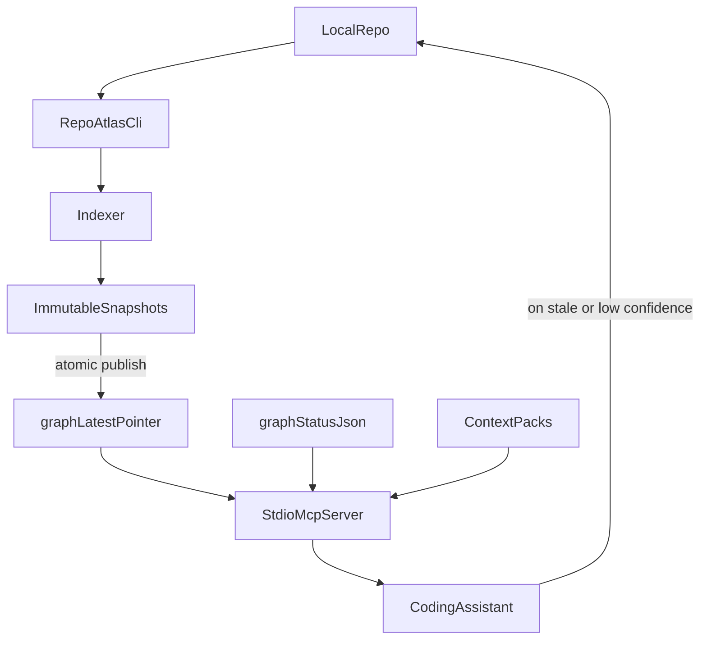

# Technical Design Document: RepoAtlas

| Field | Value |
|---|---|
| Document type | Technical Design Document |
| Version | 1.0 (draft for review) |
| Status | Open for technical review |
| Scope | Java + Spring Boot + Gradle services, local developer environment |
| Reading time | Three hours including walkthroughs and Q&A |

---

## 1. Abstract

RepoAtlas is a deterministic local code intelligence and reuse graph for Java Spring Boot systems. It indexes the repository, dependencies, Spring metadata, OpenAPI specifications, and internal service clients into immutable SQLite snapshots. A local stdio MCP server serves task-oriented, confidence-tagged graph slices to AI coding assistants and the human via a CLI. RepoAtlas does not replace live source as the source of truth. It makes the agent's first read precise, fast, and honest about uncertainty.

The contribution of this design is not "AI on a repo." It is the combination of three pieces that none of the public predecessors put together:

1. A graph that distinguishes business capability from HTTP transport.
2. A freshness model in which live source always beats the graph and the agent is told exactly which files to read directly when staleness occurs.
3. A capability bundle artifact that promotes service ownership of meaning, not just transport.

---

## 2. Background and Motivation

### 2.1 The Cost We Are Paying Today

Modern coding assistants navigate large repositories on demand. They are powerful. They also pay three recurring costs that are absorbed quietly:

1. They re-explore the same code across sessions and tasks.
2. They infer architecture from local lexical evidence and miss semantics that a compiler or a Spring container would resolve trivially.
3. They produce confident, plausible answers that do not match the actual structure of the system, especially in services where a path like `/execute` says nothing about business meaning.

In a small project these costs are tolerable. In a Java Spring Boot environment with dozens of internal client libraries, layered architecture rules, OpenAPI contracts, and platform service capabilities, the costs become substantive. Repeated exploration is expensive. Confident hallucinations are dangerous. Architecture rules go unenforced because the assistant cannot see them.

### 2.2 Prior Art

Three public projects each solve part of the problem.

| System | Strength | Gap for our environment |
|---|---|---|
| CodeGraph | Pre-indexed local graph for Claude Code; symbol relationships, call graphs, file structure | Generic syntax extraction; not Java-Spring-aware; no capability model; no freshness contract |
| code-review-graph | Persistent local graph for review; blast radius; SQLite; incremental updates | No Java symbol resolution; no service client model; no business capability concept |
| TrueCourse | Architecture rule analysis; circular dependency, layer violation, dead module, security checks | JS/TS/Python; LLM-driven rules; not deterministic-first |

RepoAtlas is not a simple combination of these tools. It is a Java platform engineering control plane that makes retrieval, analysis, and enforcement operate under one trust model. The design adds JavaSymbolSolver-grade resolution, Spring bean and annotation semantics, OpenAPI-to-controller mapping, internal service-client discovery, business capability modeling separate from transport, immutable snapshots, and a strict freshness contract where live source always wins.

RepoAtlas also adds trust mechanisms that are typically missing from graph assistants: output-level confidence calibration, explicit unsoundness ledgers for dynamic/ambiguous zones, shadow full-vs-incremental drift verification, ranked capability reuse decisions with rationale, and API-evolution risk scoring in impact/reuse outputs. The result is not only faster context retrieval; it is auditable, policy-aligned decision support for real Java service development.

### 2.3 Thesis

A deterministic, local, Java-aware architecture and capability graph delivered to the agent through a small MCP surface, with confidence tags on every edge and a hard rule that live source beats the graph, will reduce repeated exploration, prevent duplicate platform calls, and restore enforceable architecture for Spring Boot services. RepoAtlas does not need to be cleverer than the agent. It needs to be honest, fast, and locally trustworthy.

---

## 3. Goals and Non-Goals

### 3.1 Goals

- Index a Java Spring Boot service in under sixty seconds for a medium repository.
- Update the graph incrementally in under five seconds for small file changes.
- Return a precision-first context slice to the agent under fifteen files for typical tasks.
- Detect and prevent reimplementation of capabilities already provided by internal service clients.
- Block CI only on issues the tool can prove with high confidence.
- Never serve stale data silently. Every response carries a freshness verdict.

### 3.2 Non-Goals

- Multi-language support in the first release.
- A web dashboard.
- Embedding-based retrieval as a primary path.
- A deployed service. RepoAtlas runs locally.
- Auto-fix generation.
- Replacing the live source file as the canonical truth.

---

## 4. Design Principles

These are non-negotiable. The rest of the document is a faithful expansion of these eleven sentences.

1. Live source beats the graph when fingerprints disagree.
2. No silent staleness. Every response declares its freshness verdict.
3. Determinism precedes anything probabilistic.
4. Confidence travels with every important claim.
5. Capability is not endpoint.
6. Lean defaults; opt-in for everything else.
7. Local first.
8. Config wins over defaults.
9. CI must earn trust by blocking only on provable critical issues.
10. Snapshots are immutable; updates are atomic pointer swaps.
11. The agent should ask the graph before reading source, and read source when the graph admits it cannot help.

---

## 5. System Overview

### 5.1 Topology



### 5.2 Component Responsibilities

- **CLI**: lifecycle commands (`build`, `status`, `impact`, `violations`, `clients`, `capabilities`, `review`, `baseline`, `ci`, `bootstrap`).
- **Indexer**: AST extraction, symbol resolution, Spring enrichment, OpenAPI mapping, capability discovery, persistence.
- **Snapshot store**: directory of immutable SQLite files plus a single small pointer file.
- **Status**: structured `graph_status.json` (active snapshot id, freshness, rebuild worker state).
- **Context packs**: task-scoped pinned views over a snapshot, validated by file fingerprints.
- **MCP server**: Java stdio server that loads the active snapshot and answers tool calls with lean JSON.
- **Agent**: any MCP client. It is the consumer, not part of RepoAtlas.

### 5.3 Filesystem Layout

```
.repoatlas/
  config.yaml              committed
  baseline.json            committed
  graph_status.json        not committed
  graph_latest.pointer     not committed
  snapshots/
    graph_S1.sqlite        not committed
    graph_S2.sqlite        not committed
  context_packs/           not committed
  sessions/                not committed
  reports/                 not committed
  cache/                   not committed
```

### 5.4 Process Model

- One CLI invocation per command.
- One MCP server process per attached agent. Multiple agents share the active snapshot via independent processes.
- One rebuild worker per repository or worktree at a time. The worker holds `rebuild.lock`.

---

## 6. Data Model

### 6.1 Node Taxonomy

Code: `Repository`, `GradleModule`, `SourceSet`, `File`, `Package`, `Class`, `Interface`, `Enum`, `Method`, `Field`, `Constructor`, `Annotation`, `Test`.

Spring: `SpringBean`, `Controller`, `Service`, `RepositoryBean`, `ConfigurationClass`, `BeanProviderMethod`, `ScheduledJob`, `TransactionBoundary`, `Qualifier`, `Profile`, `ConditionalBean`.

API: `HttpEndpoint`, `OpenApiOperation`, `RequestSchema`, `ResponseSchema`, `SecurityRequirement`, `ErrorResponse`.

Data: `Entity`, `Table`, `RepositoryMethod`, `Mapper`, `DTO`, `DatabaseWrite`, `DatabaseRead`.

External and capability: `ExternalService`, `ServiceClientArtifact`, `ServiceClientClass`, `ClientMethod`, `ClientBean`, `RemoteEndpoint`, `BusinessCapability`, `CapabilityEvidence`.

### 6.2 Edge Taxonomy

`DECLARES`, `CONTAINS`, `IMPORTS`, `CALLS`, `EXTENDS`, `IMPLEMENTS`, `ANNOTATED_WITH`, `PROVIDES_BEAN`, `INJECTS_BEAN`, `EXPOSES_ENDPOINT`, `IMPLEMENTS_OPERATION`, `CALLS_REMOTE_ENDPOINT`, `PROVIDES_CAPABILITY`, `USES_CAPABILITY`, `READS_ENTITY`, `WRITES_ENTITY`, `TESTS`, `DEPENDS_ON`, `VIOLATES_RULE`, `AFFECTS`.

### 6.3 Required Edge Metadata

Every edge stores six fields, no exceptions:

```
confidence            high | medium | low
evidence_source       solver | spring_convention | manifest | openapi | feign | retrofit | webclient | resttemplate | okhttp | url_constant | name_match
source_file           repo-relative path
source_range          (line_start, col_start, line_end, col_end)
created_from_snapshot Sn id
reason                short, machine-stable rationale id
```

### 6.4 Symbol Identity (Hybrid)

Primary key (resolved):

```
fqClass#methodName(paramTypes...):returnType
```

Fallback key (unresolved or generated):

```
sha256(repoPath + filePath + sourceRange + symbolKindHint)
```

Promotion from fallback to primary is logged as a resolution event in `graph_status.json`. Demotion never happens silently.

### 6.5 Storage

SQLite. One snapshot per file. FTS5 indexes for symbol and capability search. No graph database, no service, no remote.

### 6.6 Logical Schema (Excerpt)

```
nodes(
  id TEXT PRIMARY KEY,
  kind TEXT NOT NULL,
  fq_signature TEXT,
  fallback_key TEXT,
  file_path TEXT,
  source_range TEXT,
  attributes_json TEXT,
  created_from_snapshot TEXT NOT NULL
)

edges(
  id TEXT PRIMARY KEY,
  src_node_id TEXT NOT NULL,
  dst_node_id TEXT NOT NULL,
  kind TEXT NOT NULL,
  confidence TEXT NOT NULL,
  evidence_source TEXT NOT NULL,
  source_file TEXT NOT NULL,
  source_range TEXT NOT NULL,
  reason TEXT NOT NULL,
  created_from_snapshot TEXT NOT NULL
)

capabilities(
  id TEXT PRIMARY KEY,
  service TEXT NOT NULL,
  display_name TEXT NOT NULL,
  domain TEXT NOT NULL,
  client_method TEXT,
  transport_json TEXT,
  business_outcome TEXT,
  side_effects_json TEXT,
  reuse_priority TEXT,
  manifest_source TEXT,
  bundle_version TEXT
)

snapshots(
  id TEXT PRIMARY KEY,
  built_at TEXT NOT NULL,
  schema_version TEXT NOT NULL,
  indexer_version TEXT NOT NULL,
  full_or_incremental TEXT NOT NULL,
  validated TEXT NOT NULL
)
```

FTS5 virtual tables exist for symbols, capabilities, endpoints, and reasons.

---

## 7. Confidence Model

### 7.1 Levels

- **High**: JavaSymbolSolver resolved, exact Spring bean type match, manifest plus OpenAPI match, exact controller route mapping, stable source fingerprint.
- **Medium**: Spring convention match, single likely implementation, source jar inference, test or call site evidence, OpenAPI without strong business metadata.
- **Low**: name match only, URL string match, bytecode string scan, ambiguous implementation, generated code without source, reflection or proxy path.

### 7.2 Behavioral Effect

| Channel | High | Medium | Low |
|---|---|---|---|
| Architecture violations (CI) | block | warn | never block |
| Impact analysis | include | include | hint only |
| Context selection | prefer | acceptable | discovery only |
| Reuse recommendation | strong recommend | recommend with direct read | lead only |

### 7.3 Propagation

- A path of edges takes the minimum confidence along the path.
- If any edge in a derived claim is `low`, the claim is `low`.
- If a node lives in dirty source, every claim about it is degraded by one tier and the node is added to `read_source_directly`.

### 7.4 Confidence vs Evidence Quality (V2 enhancement)

Confidence and evidence quality are modeled as separate axes:

- **Confidence** captures likelihood of correctness (`high`, `medium`, `low`).
- **Evidence quality** captures provenance strength (`authoritative`, `strong`, `inferred`, `weak`).

This distinction prevents a common failure mode where a claim with complete but ambiguous evidence is treated the same as a claim with weak evidence.

### 7.5 Output-Level Confidence Calibration (V2 enhancement)

In addition to edge-level confidence, major outputs compute `decision_confidence`:

- `impact_analysis`
- `architecture_violations`
- `trace_call_flow`
- `find_existing_capability`

Calibration inputs include:

- edge-confidence distribution,
- evidence-quality mix,
- ambiguity count,
- stale-file overlap,
- unsoundness flags.

This makes final recommendations auditable and prevents accidental overconfidence in derived conclusions.

---

## 8. Snapshot and Freshness Subsystem

### 8.1 Immutable Snapshots

Snapshots live under `.repoatlas/snapshots/` as `graph_Sn.sqlite`. Each snapshot is immutable. `graph_latest.pointer` is the only mutable element; it names the active snapshot.

### 8.2 Atomic Publish Algorithm

```
function publish(new_snapshot_path):
  hold_exclusive(rebuild.lock)
  validate(new_snapshot_path)            # schema, FK integrity, count tolerances, sample resolution
  if !valid:
    delete(new_snapshot_path)
    return Failed
  fsync(new_snapshot_path)
  write_temp(graph_latest.pointer.tmp, new_snapshot_id)
  fsync(graph_latest.pointer.tmp)
  rename(graph_latest.pointer.tmp, graph_latest.pointer)   # atomic on POSIX
  update(graph_status.json)
  prune_old_snapshots(retention_count)
  release(rebuild.lock)
  return Published
```

If the host crashes between `fsync` and `rename`, on next startup the partial pointer file is detected and removed; the previous pointer remains in force.

### 8.3 Validation Checks

- schema version matches indexer version
- required tables and indexes present
- foreign key integrity passes
- counts within tolerance of previous snapshot (configurable bounds)
- spot-check resolution of a fixed sample of well-known symbols

### 8.4 Retention

Configurable count, default three. Pruning runs in the same lock window as publish.

### 8.5 Freshness Verdicts

Every MCP response carries one of:

- `fresh`: snapshot fingerprints match all relevant files.
- `stale_for_relevant_files`: at least one relevant file is newer than the snapshot. Affected files appear in `read_source_directly`. Confidence is degraded.
- `no_graph`: no active snapshot. Bootstrap is required. The response is navigation-only and instructs the agent to run bootstrap or read source directly.

### 8.6 Live Source Authority Rule

When a file fingerprint disagrees with the snapshot, the file wins. The graph is authoritative only for the snapshot it was built from. There is no exception to this rule.

### 8.7 Dirty Overlay Policy (Authoritative)

RepoAtlas does not apply dirty overlays by default.

When relevant files are newer than the active snapshot, RepoAtlas returns navigation-only graph context, marks affected files as `source_newer_than_graph` in `read_source_directly`, lowers confidence, and instructs the agent to read those exact files directly.

A dirty overlay may exist as an explicit opt-in diagnostic mode. Every overlay-derived field must be labeled overlay-based in the response. Overlay results are forbidden for default MCP responses, high-confidence recommendations, CI gates, and architecture enforcement. Any answer that uses overlay data must include `overlay_used: true` and `not_safe_for: [ci_gates, high_confidence_recommendations, architecture_enforcement]`.

### 8.8 Incremental Drift Verification (V2 enhancement)

Incremental performance is valuable only if incremental correctness stays close to full rebuild truth. V2 adds sampled shadow verification:

- On configurable cadence (for example, nightly CI or 1/N local builds), run a shadow full rebuild.
- Compare the shadow full snapshot against the latest incremental snapshot across:
  - node and edge key sets,
  - critical analyzer outputs,
  - golden MCP query outputs.
- Classify divergence as `critical`, `major`, or `minor`.

Policy:

- `critical` divergence triggers immediate remediation and full rebuild fallback.
- `major` divergence raises warning and forces a full rebuild.
- `minor` divergence is tracked for trend analysis.

---

## 9. Context Pack Subsystem

### 9.1 Why Packs Exist

A long agent session may visit several tasks. Pinning the entire session to one snapshot is wrong (snapshot drifts across tasks). Pinning every tool call independently is wrong (adjacent calls in the same task should reuse the same view). The right unit is the task. A context pack is the task-scoped pinned view.

### 9.2 Pack Schema

```
{
  "context_pack_id": "rbac_perm_check_S14",
  "task": "permission check for dataset read",
  "graph_snapshot": "S14",
  "files": ["DatasetController.java", "DatasetService.java", "RbacClient.java"],
  "symbols": ["DatasetController.read", "DatasetService.requireReadPermission"],
  "fingerprints": {"DatasetService.java": "abc123"}
}
```

### 9.3 Lifecycle

- Created when the agent calls `minimal_context_for_task` or `find_existing_capability` for a new task.
- Validated on every subsequent tool call in the same task scope by recomputing fingerprints.
- Refreshed when a newer snapshot includes the changed files.
- Demoted to navigation-only with explicit `read_source_directly` when files have changed and the new graph does not yet include them.

---

## 10. Indexing Pipeline

### 10.1 Pipeline Stages


### 10.2 Repo Scan

- Walk repository.
- Honor `.gitignore`, `.repoatlasignore`, and `config.yaml`'s `generated.paths`.
- Detect Gradle modules and source sets.
- Compute SHA-256 fingerprints for files within scope.

### 10.3 AST and Symbol Resolution

- Parse with JavaParser.
- Configure JavaSymbolSolver with: project source roots, dependency jars from local Gradle/Maven cache, optional source jars.
- Capture packages, classes, interfaces, enums, methods, fields, constructors, annotations, imports, and source ranges.
- Capture call edges with confidence:
  - `high` if the call resolves to a unique declaration.
  - `medium` if it narrows to a unique candidate after Spring convention resolution.
  - `low` for unresolved targets.

### 10.4 Spring Enrichment

- Detect annotations (`@RestController`, `@Controller`, `@Service`, `@Component`, `@Repository`, `@Configuration`, `@Bean`, `@Entity`, `@FeignClient`, route mappings, `@Transactional`, `@Async`, `@Scheduled`).
- Construct `SpringBean`, `Controller`, `Service`, `RepositoryBean`, `ConfigurationClass`, `BeanProviderMethod`, `ScheduledJob`, `TransactionBoundary`, `Qualifier`, `Profile`, `ConditionalBean`.
- Resolve `INJECTS_BEAN` edges to declared bean providers when types resolve.

### 10.5 OpenAPI Extraction and Mapping

- Parse OpenAPI specs into `OpenApiOperation`, `RequestSchema`, `ResponseSchema`, `SecurityRequirement`, `ErrorResponse`.
- Map to controller methods using a priority chain:
  1. exact `operationId`-to-method-name match
  2. `(path, method)` route equality
  3. normalized name heuristics
  4. tags and class-name conventions
- Each match records `confidence`, `reason`, and any ambiguity. Ambiguous mappings are reported.

### 10.6 Edge Construction Discipline

Every constructed edge passes through a single funnel that attaches required metadata (confidence, evidence_source, source_file, source_range, created_from_snapshot, reason). There is no shortcut path.

### 10.7 Persistence

Write to `graph_S(n+1).sqlite`. Validate. Atomic pointer swap. Update `graph_status.json`.

---

## 11. Service Client and Capability Subsystem

### 11.1 Why Capability Is Modeled Separately From Endpoint

Platform and legacy services often expose generic transport-level paths such as `/execute`, `/process`, `/lookup`. These paths are transport, not meaning. An engineer asking "is there a way to evaluate a permission on a dataset" is not asking about HTTP. The graph that conflates transport and meaning will mislead. RepoAtlas separates the two: `HttpEndpoint` describes transport, `BusinessCapability` describes meaning.

### 11.2 Capability Source-of-Truth Hierarchy

- Highest: owner-declared capability manifest plus OpenAPI or source evidence.
- High: OpenAPI with strong `operationId`, schemas, examples, and generated client mapping.
- Medium: source jar or linked workspace inference, tests and call sites, Javadocs and README examples.
- Low: bytecode string scan, URL string match, method name only, path only.

### 11.3 Capability Manifest Example: RBAC Platform Service

The example below is the source-of-truth manifest for a platform service that owns principals (users, groups), roles, and managed resources (pipelines, datasets, workflows, notebooks). It owns CRUD for those entities and the canonical permission-check used by every consuming service.

```
{
  "service": "rbac_platform",
  "owner_team": "platform_identity_team",
  "client": {
    "bean_type": "com.company.rbac.client.RbacClient",
    "provided_by_spring": true,
    "auto_configuration": "META-INF/spring/com.company.rbac.client.RbacClientAutoConfiguration.imports"
  },
  "capabilities": [
    {
      "id": "rbac.principal.get",
      "display_name": "Get principal by id",
      "client_method": "getPrincipal",
      "transport": {"http_method": "GET", "path": "/principals/{principalId}"},
      "business_outcome": "Returns the canonical principal record (user or group) including active roles and group membership.",
      "inputs": ["principalId"],
      "outputs": ["principal", "active_roles", "group_membership", "etag"],
      "side_effects": [],
      "idempotent": true,
      "domain": "rbac.identity",
      "stability": "stable",
      "owner": "platform_identity_team"
    },
    {
      "id": "rbac.permission.check",
      "display_name": "Check whether a principal can perform an action on a resource",
      "client_method": "checkPermission",
      "transport": {"http_method": "POST", "path": "/permissions/check"},
      "business_outcome": "Authoritative authorization decision for the principal, action, and resource.",
      "inputs": ["principal", "action", "resource", "context"],
      "outputs": ["decision", "matched_grants", "deny_reasons", "evaluated_at"],
      "side_effects": ["writes audit event"],
      "idempotent": true,
      "domain": "rbac.authorization",
      "stability": "stable",
      "owner": "platform_identity_team",
      "reuse_priority": "must_reuse"
    },
    {
      "id": "rbac.resource.register",
      "display_name": "Register a managed resource",
      "client_method": "registerResource",
      "transport": {"http_method": "POST", "path": "/resources"},
      "business_outcome": "Registers a resource of a given type under an owning principal.",
      "inputs": ["resource_type", "external_id", "owner_principal", "attributes", "idempotency_key"],
      "outputs": ["resource_id", "registered_at"],
      "side_effects": ["writes audit event", "publishes resource.registered event"],
      "idempotent_with": "idempotency_key",
      "domain": "rbac.resource",
      "stability": "stable",
      "owner": "platform_identity_team",
      "supported_resource_types": ["pipeline", "dataset", "workflow", "notebook"]
    }
  ]
}
```

Schema notes:

- `id` is domain-prefixed so capability collisions across bundles are detectable on consumer load.
- Idempotency is expressed as `idempotent: true` for safe reads and `idempotent_with: "idempotency_key"` for retry-safe writes.
- `reuse_priority: "must_reuse"` instructs the consumer-side reuse analyzer to flag any local re-implementation.
- `side_effects` is enumerated precisely. RepoAtlas uses it to decide whether reuse is safe in a read-only path.
- `supported_resource_types` is a closed set; consumers attempting other types should be flagged.

### 11.4 Capability Bundle Artifact

Provider repositories commit `capabilities.yaml`, validate it in CI, and publish a Maven artifact:

```
repoatlas_client_bundle.zip
  capabilities.json
  openapi_snapshot.json
  client_symbols.json
  checksums.json
```

Consumer repositories cache the bundle into local SQLite. SQLite is never the canonical source.

### 11.5 Discovery Flow Inside a Consumer Repository

1. Parse the Gradle dependency graph.
2. Match internal client artifacts using configured patterns (`*_client`, `*_sdk`, `*_openapi_client`).
3. Inspect jars and source jars from local cache.
4. Discover Spring auto-configured client beans via `META-INF/spring/...AutoConfiguration.imports` and `META-INF/spring.factories`.
5. Map client methods to remote operations via the priority chain: bundle manifest → packaged OpenAPI → generated annotations → Feign → Retrofit → WebClient → RestTemplate → OkHttp builder → URL string constants.
6. Attach `BusinessCapability` nodes from the manifest when available; otherwise infer with explicit confidence.

### 11.6 Reuse Recommendation Contract

```
{
  "recommended_reuse": [
    {
      "client": "RbacClient",
      "method": "checkPermission",
      "bean_available": true,
      "provided_by": "rbac_client",
      "dependency_version": "4.2.0",
      "capability": "rbac.permission.check",
      "transport": "POST /permissions/check",
      "confidence": "high",
      "reuse_priority": "must_reuse"
    }
  ],
  "read_source_directly": ["RbacClient.java"]
}
```

Without manifest, confidence drops to `medium` and a `suggestion` field requests that owners publish a manifest.

### 11.7 Ranked Capability Recommendation Pipeline (V2 enhancement)

V1 establishes capability discovery. V2 formalizes recommendation ranking so answers are not just candidate lists.

Ranking stages:

1. **Candidate generation**
   - manifest capabilities,
   - client method mappings,
   - callsite and test usage motifs,
   - dependency and bean availability.
2. **Scoring**
   - confidence and evidence quality,
   - `reuse_priority` policy (for example, `must_reuse`),
   - side-effect fit for the caller path,
   - dependency fit (already present vs new dependency),
   - API evolution risk.
3. **Explainability**
   - return `rank_score` and `why` factors in output.

This turns reuse guidance into an auditable decision rather than a heuristic suggestion.

---

## 12. Rebuild Orchestration

### 12.1 Initial Build

Always full. There is no incremental path until a trusted snapshot exists.

### 12.2 Foundation-Change Full Rebuild Triggers

- `build.gradle`, `settings.gradle`, `gradle.properties`
- Java version change
- dependency or classpath version changes
- `.repoatlas/config.yaml`
- OpenAPI structure additions or changes
- generated source directory changes
- RepoAtlas indexer or graph schema version change
- large package moves or mass renames

### 12.3 Incremental Rebuild Algorithm

```
function incremental(changed_files, max_depth):
  seeds = set(changed_files)
  affected = bfs(graph, seeds, edges_in: [IMPORTS, CALLS, IMPLEMENTS, INJECTS_BEAN, EXPOSES_ENDPOINT, IMPLEMENTS_OPERATION, TESTS], depth: max_depth)
  reparse(affected ∪ seeds)
  rebuild_edges(affected ∪ seeds)
  validate()
  publish()
```

Default depth: local 2, CI 3.

### 12.4 Worker Model

One rebuild worker per repository or worktree. The worker holds `rebuild.lock`. MCP readers do not block the worker. The worker does not block readers.

---

## 13. Concurrency Model and Parallel Agents

### 13.1 Single Writer, Many Readers

Only one process per repository holds `rebuild.lock`. Any number of MCP readers can attach to the same active snapshot through independent processes.

### 13.2 Per-Worktree Isolation for Parallel Agents

For parallel agent work, the recommended structure is one worktree per agent and one graph per worktree. This avoids the impossible problem of making two simultaneous edits to the same file logically consistent.

### 13.3 Same-File Conflict

When multiple agents touch the same file in one worktree, RepoAtlas warns, lowers confidence, and recommends separate worktrees. It does not block.

### 13.4 No Dirty Overlay Default

The conflict policy never relies on overlay merging. It surfaces the conflict and routes the agent to live source.

---

## 14. MCP Server Specification

### 14.1 Transport

stdio. The agent host launches the server as a subprocess and communicates over standard input and standard output. HTTP is optional later.

### 14.2 Language

Java. Same module as the indexer.

### 14.3 Tool Catalog

Task-oriented tools only:

| Tool | Purpose |
|---|---|
| `repo_summary` | High-level repo map |
| `search_symbols` | Find class, method, endpoint, package |
| `get_symbol_context` | One symbol plus its direct edges |
| `trace_call_flow` | Path from controller to repository or client |
| `impact_analysis` | Blast radius for a file or diff |
| `architecture_violations` | Current violations |
| `openapi_mapping` | API path to Java controller and service flow |
| `minimal_context_for_task` | The smallest file set the agent should read |
| `find_existing_capability` | Reuse recommendation for a described capability |
| `service_client_inventory` | Internal clients available in this repo |
| `graph_status` | Snapshot id, freshness, rebuild state |
| `refresh_context_pack` | Recompute pack against current snapshot |

### 14.4 Default Response Shape

```
{
  "files": [],
  "symbols": [],
  "graph_status": "fresh",
  "confidence": "high",
  "read_source_directly": []
}
```

### 14.5 Stale Response Shape

```
{
  "files": [],
  "symbols": [],
  "graph_status": "stale_for_relevant_files",
  "confidence": "medium",
  "read_source_directly": ["DatasetService.java"]
}
```

### 14.5.1 Trust Envelope (V2 enhancement)

For major analysis and recommendation tools, V2 adds a trust envelope:

- `decision_confidence`
- `evidence_quality`
- optional `unsoundness_ledger`

Example:

```
{
  "graph_status": "fresh",
  "decision_confidence": "medium",
  "evidence_quality": "strong",
  "unsoundness_ledger": [
    {
      "type": "reflection_unresolved",
      "symbol": "com.company.Foo#bar",
      "impact": "possible_missing_callee"
    }
  ],
  "read_source_directly": ["Foo.java"]
}
```

This envelope keeps responses compact while preserving auditability.

### 14.6 Source Excerpt Opt-In

Only when the caller sets `include_source: true` and `max_lines_per_symbol`. Excerpts never appear in default responses.

### 14.7 No Generic SQL

In this release, the server does not expose a raw SQL surface. If introduced later, it must be guarded by allowlisted templates, max rows, max bytes, timeout, sensitive-field redaction, and read-only enforcement.

### 14.8 Tool Schemas

Each tool publishes a schema with: name, description, input parameters with types, output schema, error envelope. The schema is part of the MCP capability advertisement.

---

## 15. Architecture Analyzer Suite

### 15.1 Analyzers

- Circular dependencies via Tarjan strongly connected components on the package or module graph.
- Layer violations driven by the `can_call` matrix in `config.yaml`.
- Dead modules: zero incoming edges excluding configured entry points.
- God service: configurable thresholds on public methods, dependencies, and outgoing edges.
- Blast radius: reverse BFS from changed symbols across `CALLS`, `IMPLEMENTS`, `INJECTS_BEAN`, `EXPOSES_ENDPOINT`, `IMPLEMENTS_OPERATION`, `TESTS`.
- OpenAPI drift: spec-without-code and code-without-spec diagnostics with confidence.
- Risk score: weighted aggregate of impact size, public surface, persistence touchpoints, external client calls, missing tests, confidence.
- Reuse detection: connection between proposed changes and existing capabilities.

### 15.2 Output Formats

- JSON primary.
- SARIF export for CI dashboards and code-scanning integrations.
- Human-readable Markdown for `repoatlas review`.

### 15.3 Baseline Discipline

`repoatlas baseline` snapshots existing legacy issues. CI gates fail only on new critical high-confidence issues over baseline.

### 15.4 Analyzer Output Requirements (V2 enhancement)

For every blocking-capable finding, analyzers must emit:

- `decision_confidence`
- `evidence_quality`
- `derivation_path` (edge ids or symbol path)
- optional `unsoundness_ledger`

Blocking decisions in CI must be reproducible from emitted evidence without additional hidden state.

---

## 16. CI Gate Model

### 16.1 Blocking Set

- graph build failure
- corrupted snapshot
- invalid schema
- new high-confidence critical layer violation
- new high-confidence OpenAPI drift
- new high-confidence circular package dependency

### 16.2 Warning Set

- medium-confidence call ambiguity
- low-confidence edges
- possible dead module
- possible duplicated service client usage
- god service risk
- large blast radius
- ambiguous Spring bean mapping
- OpenAPI mapping with weak evidence

### 16.3 Overlay Forbidden

`ci.reject_overlay: true` is mandatory. CI never consumes dirty overlay results.

### 16.4 Confidence and Evidence Gate (V2 enhancement)

A finding is blocking only when all conditions hold:

- severity is in the configured blocking set,
- `decision_confidence == high`,
- `evidence_quality in {authoritative, strong}`,
- `overlay_used != true`.

If any condition is missing, the finding is downgraded to warning with explicit rationale.

### 16.5 Incremental Drift CI Job (V2 enhancement)

Add `shadow_full_rebuild_diff` job to CI:

- runs a sampled shadow full rebuild,
- compares it against incremental output,
- enforces divergence thresholds (`critical`, `major`, `minor`).

This prevents silent drift in incremental mode.

---

## 17. Configuration

### 17.1 Authority

`.repoatlas/config.yaml` is authoritative for layer rules, generated paths, service client patterns, ambiguity thresholds, and CI policy. Defaults exist only to bootstrap the file.

### 17.2 Shape

```
layers:
  controller:
    packages: ["..controller.."]
    can_call: [service, mapper]
  service:
    packages: ["..service.."]
    can_call: [repository, client, mapper]
  repository:
    packages: ["..repository.."]
    can_call: []

ambiguity:
  ci_threshold_percent: 8

generated:
  paths:
    - "**/generated/**"
    - "**/build/**"
    - "**/target/**"

service_clients:
  dependency_patterns:
    - "*_client"
    - "*_sdk"
    - "*_openapi_client"

ci:
  block_on:
    - graph_health
    - critical_high_confidence_architecture
    - high_confidence_openapi_drift
    - high_confidence_new_circular_dependency
  reject_overlay: true

mcp:
  dirty_overlay:
    default: off
    allow_experimental_opt_in: true
    forbidden_uses:
      - default_responses
      - high_confidence_recommendations
      - ci_gates
      - architecture_enforcement

trust:
  decision_confidence:
    weights:
      edge_confidence: 0.40
      evidence_quality: 0.25
      ambiguity_penalty: 0.15
      stale_overlap_penalty: 0.10
      unsoundness_penalty: 0.10
  divergence:
    shadow_full_rebuild:
      enabled: true
      cadence: nightly
      max_critical_diff: 0
      max_major_diff_percent: 2
  unsoundness:
    expose_ledger_default: true

capability_ranking:
  enabled: true
  feature_weights:
    confidence: 0.30
    evidence_quality: 0.20
    reuse_priority: 0.20
    side_effect_fit: 0.15
    dependency_availability: 0.10
    api_evolution_risk: 0.05

api_evolution:
  risk_scoring:
    enabled: true
    warn_threshold: 0.45
    block_threshold: 0.75
```

---

## 18. CLI Surface

```
repoatlas init
repoatlas build
repoatlas status
repoatlas search <symbol>
repoatlas impact <path or symbol>
repoatlas violations
repoatlas openapi_drift
repoatlas clients
repoatlas capabilities "<query>"
repoatlas review
repoatlas baseline
repoatlas ci
repoatlas mcp
repoatlas bootstrap
```

`repoatlas bootstrap` runs:

1. init config
2. full local graph build
3. internal service client indexing
4. Spring client bean discovery
5. client method to remote API mapping
6. MCP install
7. graph and capability health summary

---

## 19. Worked Example A: RBAC Permission Reuse

### 19.1 Setup

The developer is working in a service that needs to gate dataset reads on the principal's permission. The service depends on `rbac_client` version `4.2.0`, which provides `RbacClient` as a Spring bean.

The developer's first instinct is to add a small OkHttp call directly to `POST /permissions/check`. This is the duplication RepoAtlas exists to prevent.

### 19.2 Agent Interaction

The agent calls:

```
find_existing_capability({
  "task": "check whether a user can read a dataset",
  "context": "I am about to add an authorization check in DatasetService.read"
})
```

### 19.3 RepoAtlas Response

```
{
  "files": ["RbacClient.java", "DatasetService.java"],
  "symbols": ["DatasetService.read", "RbacClient.checkPermission"],
  "graph_status": "fresh",
  "decision_confidence": "high",
  "evidence_quality": "authoritative",
  "confidence": "high",
  "read_source_directly": [],
  "recommended_reuse": [
    {
      "client": "RbacClient",
      "method": "checkPermission",
      "bean_available": true,
      "provided_by": "rbac_client",
      "dependency_version": "4.2.0",
      "capability": "rbac.permission.check",
      "transport": "POST /permissions/check",
      "confidence": "high",
      "reuse_priority": "must_reuse"
    }
  ],
  "do_not_read": ["generated/openapi/**"]
}
```

### 19.4 What Just Happened

- The Gradle dependency scanner identified `rbac_client` as an internal client artifact.
- The Spring auto-configuration metadata reader found `RbacClientAutoConfiguration.imports`.
- The capability bundle for `rbac_platform` was loaded; the `rbac.permission.check` capability was matched on `business_outcome` and `client_method`.
- The reuse priority was `must_reuse`; the response is high confidence; the agent is told to use the existing client.

If the manifest were missing, the same flow would still surface `RbacClient.checkPermission` based on source jar and OpenAPI, but the confidence would be `medium` and the response would suggest publishing a manifest.

---

## 20. Worked Example B: Refund Cancellation Impact

### 20.1 Setup

The developer changes `RefundService.cancelRefund` to reverse a payment ledger entry before saving. They want to know the blast radius before opening the PR.

### 20.2 CLI Invocation

```
repoatlas impact src/main/java/com/company/payment/RefundService.java
```

### 20.3 Output (Excerpt)

```
{
  "graph_status": "fresh",
  "decision_confidence": "high",
  "evidence_quality": "strong",
  "confidence": "high",
  "entry_points": [
    {"type": "http_endpoint", "method": "POST", "path": "/refunds/{id}/cancel",
     "controller": "RefundController.cancelRefund", "confidence": "high"}
  ],
  "core_flow": [
    "RefundController.cancelRefund",
    "RefundService.cancelRefund",
    "PaymentLedgerService.reverseEntry",
    "RefundRepository.save"
  ],
  "data_touchpoints": ["RefundEntity", "refunds table", "PaymentLedgerEntity"],
  "external_touchpoints": ["PaymentGatewayClient.cancelAuthorization"],
  "transaction_boundaries": ["RefundService.cancelRefund has @Transactional"],
  "tests_to_read": ["RefundServiceTest", "RefundControllerTest"],
  "risk_notes": [
    "Public API path",
    "Database write path",
    "External payment client call",
    "One medium-confidence edge due to multiple PaymentGatewayClient implementations"
  ],
  "read_source_directly": []
}
```

### 20.4 Discussion Points

- The HTTP endpoint and the OpenAPI operation are linked by `IMPLEMENTS_OPERATION` with high confidence.
- The `Transactional` boundary is preserved and surfaced; it is meaningful for review because it widens the failure scope.
- One edge is medium confidence; the report names it explicitly so the reviewer can read source for that path.

---

## 21. Performance and Capacity

### 21.1 Targets

| Metric | Target |
|---|---|
| Initial full index, medium service | < 60 s |
| Incremental rebuild, small change set | < 5 s |
| Typical context slice | <= 15 files |
| `repoatlas review` end to end | < 30 s |
| MCP response p99 | < 250 ms for cached tools, < 1 s for analytic tools |
| Snapshot disk footprint per snapshot, medium service | < 80 MB |

### 21.2 Scaling Behavior

- Indexer scales linearly with source size in lines and quadratically only in pathological cyclic dependency graphs (mitigated by SCC condensation).
- Snapshot retention is bounded by configuration; default retention of three keeps disk pressure predictable.
- MCP responses are bounded by tool-specific row caps; no tool returns unbounded result sets.

### 21.3 Resource Profile

- CPU: dominant during initial build and full rebuilds; idle otherwise.
- Memory: bounded by AST and resolution cache size; configurable.
- Disk: snapshots only; no logs grow without bound.
- Network: none in default operation.

### 21.4 Trust-Quality Targets (V2 enhancement)

| Metric | Target |
|---|---|
| User-visible outputs carrying `decision_confidence` + `evidence_quality` | >= 95% |
| Stale-relevant responses containing `read_source_directly` | 100% |
| Critical divergence in shadow full-vs-incremental diff | 0 |
| Major divergence in shadow full-vs-incremental diff | <= 2% |
| Capability recommendation response includes rank rationale | 100% |
| Duplicate direct-call prevention trend | increasing release over release |

---

## 22. Security and Privacy

### 22.1 Source Confidentiality

- All processing is local. No source content is sent off the developer machine.
- MCP responses do not include source excerpts unless the caller opts in with `include_source: true`.
- Reports are written to `.repoatlas/reports/` and are not committed.

### 22.2 Capability Manifest Trust

- Manifests are read from artifacts already trusted by the build system (`local cache first`).
- Future: signing of `repoatlas_client_bundle.zip` and verification on consumer load.

### 22.3 Generic Query Surface

- Not exposed in this release.
- If reintroduced, it must enforce: allowlisted templates, max rows, max bytes, timeout, sensitive-field redaction, read-only.

### 22.4 Dirty Overlay

- Off by default.
- Forbidden for default responses, high-confidence recommendations, CI gates, architecture enforcement.

---

## 23. Failure Modes and Recovery

### 23.1 Indexer

- Java parse failure: skip file, log, fall back to identity hash for partial extraction.
- Symbol resolution failure: degrade affected edges to medium or low; never elevate.
- OpenAPI parse failure: skip spec, surface in `graph_status.json`, do not block the build.

### 23.2 Snapshot Store

- Disk full: discard new snapshot, keep current pointer.
- Pointer corruption: detect on startup, fall back to most recent valid snapshot, record incident.
- Validation failure: discard, log, retry on next trigger.

### 23.3 MCP Server

- Snapshot not found: return `graph_status: no_graph` and instruct bootstrap.
- Tool error: return error envelope (`error_code`, `error_reason`); never silent failure.
- Stdio framing error: terminate cleanly; harness restarts the subprocess.

### 23.4 Capability Subsystem

- Missing manifest: degrade to inference, surface `suggestion`.
- Bundle checksum mismatch: refuse to load, log, surface as warning.
- Conflicting capability id: refuse both sources for that id, surface conflict, prefer the manifest with the explicit override or domain prefix.

### 23.5 CI

- Graph build failure: block.
- Critical high-confidence violation: block.
- Overlay attempted: block.
- Warning growth: report, do not block.

### 23.6 Trust Layer (V2 enhancement)

- Confidence calibration misconfiguration: fall back to conservative defaults and emit warning in `graph_status.json`.
- Missing evidence-quality fields for blocking-capable findings: downgrade finding to warning and mark analyzer contract violation.
- Shadow full-rebuild divergence beyond threshold: mark incremental state degraded and force full rebuild.
- Unsoundness ledger generation failure: preserve primary result but set `decision_confidence` ceiling to `medium` and add warning.

---

## 24. Testing Strategy

### 24.1 Indexer

- AST extraction correctness on Java 21 fixture set.
- Symbol resolution sanity for common call patterns including overloads, generics, and Spring proxies.
- Spring annotation and route extraction coverage.
- OpenAPI parsing and mapping heuristic tests.

### 24.2 Analyzers

- Tarjan SCC fixture graphs.
- Reverse BFS blast radius fixture graphs.
- Layer rule pass and fail matrices.
- Dead module and risk score deterministic tests.
- Output-level confidence calibration tests using synthetic ambiguity and stale-overlap cases.
- Evidence-quality propagation tests (`authoritative`, `strong`, `inferred`, `weak`) across analyzer outputs.
- Unsoundness-ledger presence tests for reflection/proxy-heavy fixtures.

### 24.3 Snapshot and Freshness

- Crash injection between `fsync` and `rename`.
- Disk-full injection during publish.
- Schema migration triggering full rebuild.
- Shadow full-vs-incremental divergence harness with critical/major/minor classification tests.

### 24.4 MCP

- Tool schema validation.
- Response shape conformance.
- Bound enforcement for row caps and byte caps.
- Excerpt opt-in pathway.

### 24.5 Capability Subsystem

- Manifest schema validation.
- Bundle checksum verification.
- Conflict resolution between two providers.
- Inference path priority (manifest > OpenAPI > Feign > others).
- Ranking pipeline tests for `find_existing_capability` with feature-weight sensitivity checks.
- API evolution risk scoring tests and warning-threshold behavior.

### 24.6 End to End

- Pilot Spring service: bootstrap, build, impact, violations, openapi_drift, clients, capabilities, review.
- Two-service federation question.
- Dirty file routing into `read_source_directly`.

---

## 25. Rollout Plan

### 25.1 Phase 1: Pilot

- Two related Spring Boot services on developer machines.
- Provider service publishes a `capabilities.yaml` and bundle artifact.
- Consumer service indexes the bundle.
- Local CLI flows validated end to end.
- CI baseline established.

### 25.2 Phase 2: Internal Beta

- Five to ten services across two teams.
- CI gate enabled for graph health and high-confidence critical violations.
- Manifests encouraged but not required.

### 25.3 Phase 3: Org Rollout

- Manifests required for capabilities flagged as `must_reuse`.
- CI ambiguity threshold tuned per team.
- HTTP transport for MCP introduced for shared developer tooling.

### 25.4 Out of Scope for First Release

- Multi-language support.
- Embedding-based retrieval as a primary path.
- Web dashboard.
- Manifest signing (planned for Phase 3).

---

## 26. Alternatives Considered

This section is the deliberate trade-off log. For each meaningful decision, the alternative considered, the choice made, and the reason.

| Decision area | Alternative considered | Choice | Reason |
|---|---|---|---|
| Symbol identity | Location-only | Hybrid signature + location | Survives moves and refactors while keeping unresolved continuity |
| Storage topology | Single shared DB | Per-repo + federation | Matches developer mental model; federation is opt-in |
| Call resolution | Strict (drop unresolved) | Best-effort with confidence tiers | Honesty beats false cleanliness |
| Context slice objective | Recall-first | Precision-first with `expand` | Lean default protects token budget |
| Rule authority | Hardcoded | Config-authoritative | Rules are organizational policy |
| OpenAPI ambiguity | Hard fail | Top candidate + threshold + override | Practical for evolving APIs |
| Incremental rebuild | Always full | Foundation-aware incremental | Fast feedback with safety net |
| MCP transport | HTTP primary | stdio primary | Zero deployment, native subprocess fit |
| MCP language | TypeScript | Java (same module as indexer) | One language on the hottest path |
| Response default | Snippets included | Metadata-first, snippets opt-in | Lean default; explicit opt-in is auditable |
| Response profile | Decision-only | Decision + evidence | Engineer needs the audit trail |
| Thresholds | Aggressive | Conservative configurable | Reduce false positives at rollout |
| Reports | JSON only | JSON + SARIF | Free CI integration |
| Schema evolution | Blocking rebuild | Non-blocking auto rebuild | Developer never waits |
| Concurrency | Multi-writer | Single writer many readers | Consistent inputs |
| Same-file conflict | Hard block | Warn + degrade + recommend worktree | Honors live source authority |
| Dirty overlay | Merged by default | Off by default; opt-in diagnostic only | Prevents silent inconsistency |
| Freshness metadata | Verbose | Lean (status, confidence, read_source_directly) | Low token overhead, sufficient honesty |
| CI gates | Block all | Block only provable critical | Earns trust |
| Bootstrap | Init only | Full bootstrap including capability indexing | One command to productive |
| Client capability scope | Thin slice | Full scope including OkHttp inference | Where duplication is most expensive |
| Manifest policy | Required immediately or never | Optional now, required later | Adoption without flag day |
| Artifact source | Always remote | Local cache first | Deterministic, offline-safe |
| Capability naming | Endpoint-derived | Layered model with `BusinessCapability` | Transport is not meaning |
| MCP query surface | Generic SQL | Fixed task tools only | Bounded, auditable |
| SQLite governance | Committed canonical | Local cache only | Manifests are canonical |
| Live source authority | Graph authoritative within snapshot | Live source always wins on disagreement | The single rule that makes freshness enforceable |

---

### 26.1 Additional V2 Trade-off Decisions

| Decision area | Alternative considered | Choice | Reason |
|---|---|---|---|
| Output trust model | Edge confidence only | Edge confidence + output `decision_confidence` + `evidence_quality` | Final answers must be auditable, not only raw graph facts |
| Incremental correctness assurance | Policy-only confidence in incremental rebuild | Shadow full rebuild sampling and divergence checks | Prevent silent incremental drift |
| Reuse recommendations | Unranked candidate lists | Ranked recommendations with rationale | Improves actionability and reduces duplicate integrations |
| Conformance evidence | Static-only forever | Static-first with optional runtime corroboration | Keep determinism by default while reducing disputed false positives |
| API risk handling | Ignore evolution in reuse and impact | API evolution risk scoring | Prevent recommendations that are technically valid but migration-risky |

## 27. Glossary

- **Active snapshot**: the snapshot named by `graph_latest.pointer`.
- **Capability**: a `BusinessCapability` node, distinct from any HTTP endpoint.
- **Confidence**: `high`, `medium`, or `low` tag on edges and answers.
- **Context pack**: task-scoped pinned view over a snapshot, validated by file fingerprints.
- **Foundation change**: a change that requires a full rebuild rather than incremental.
- **Live source**: the current bytes on disk in the developer working tree.
- **Pointer**: `graph_latest.pointer`, the small file naming the active snapshot.
- **Snapshot**: an immutable SQLite file representing one full or incremental build of the graph.
- **Stale**: the file fingerprint disagrees with the snapshot.

---

## 28. References

- Model Context Protocol specification (transports, tools, resources).
- JavaParser and JavaSymbolSolver project documentation.
- ArchUnit (referenced for layer and slice concepts; not a runtime dependency in this release).
- OpenAPI Specification.
- SQLite documentation, including atomic file rename semantics on POSIX.

---

## 29. Follow ups

- Cross-repo federation semantics for joined queries on a global capability namespace.
- Manifest signing and provenance once required for CI enforcement.
- Cost model for keeping multiple snapshots on disk in monorepos.
- Detecting weak API paths like /execute, /process, /run and inferring richer business capability labels safely.

---
