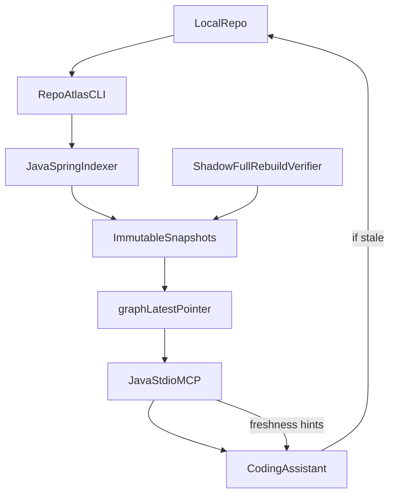

# Technical Design Document (V2): RepoAtlas

| Field | Value |
|---|---|
| Document type | Technical Design Document |
| Version | 2.0 (research-integrated) |
| Status | Draft for technical review |
| Scope | Java + Spring Boot + Gradle services, local-first execution |
| Primary input docs | `REPOATLAS_TDD.md`, `REPOATLAS_RESEARCH_SYNTHESIS.md` |

---

## 0. What Changed Since V1

This section is a quick reviewer guide. It highlights what changed in V2 without requiring a full re-read of V1.

### 0.1 Major additions

- **Output-level confidence calibration:** confidence is now computed for final answers, not only raw graph edges.
- **Unsoundness ledger:** responses can explicitly disclose reflection/proxy/ambiguous wiring blind spots.
- **Incremental correctness verifier:** sampled shadow full rebuilds now check incremental drift.
- **Ranked capability recommendations:** `find_existing_capability` now has an auditable ranking model.
- **Evidence quality dimension:** `evidence_quality` is now distinct from confidence.
- **API evolution risk modeling:** impact and reuse outputs can include compatibility/evolution risk.
- **Optional hybrid conformance mode:** static conformance remains default; runtime corroboration is optional.

### 0.2 What remained intentionally unchanged

- Local-first operation and deterministic indexing posture.
- Immutable snapshot model with atomic pointer swap.
- Live source authority when fingerprints disagree.
- Strict dirty-overlay default-off policy for normal responses and CI enforcement.
- Config-driven architecture policy and conservative CI blocking philosophy.

### 0.3 Backward compatibility

- Existing V1 MCP tool names and CLI commands remain valid.
- New trust fields are additive and can be ignored by older consumers during migration.
- Migration is staged: warning-first adoption for new trust constraints, then blocking after baseline stabilization.

---

## 1. Executive Summary

RepoAtlas is a deterministic, local code intelligence and capability graph for Java/Spring systems. It indexes code structure, framework semantics, OpenAPI contracts, and internal service-client capabilities into immutable SQLite snapshots and serves compact task-oriented context through MCP.

V2 strengthens V1 by integrating research-backed hardening controls:

- output-level confidence calibration,
- explicit unsoundness reporting,
- sampled full-vs-incremental drift verification,
- ranking-based capability recommendation,
- evidence-quality modeling,
- API evolution risk integration,
- and an optional hybrid static+runtime conformance mode.

The core posture remains unchanged: live source always wins when fingerprints disagree.

---

## 2. Why V2 Exists

V1 established architecture and workflows. Research synthesis identified seven material risks that could erode trust at scale:

1. confidence not calibrated at final-answer level,
2. unsoundness not exposed as a first-class artifact,
3. incremental correctness not continuously validated against full rebuild,
4. capability recommendations under-specified as ranked decisions,
5. static-only conformance blind to runtime divergences,
6. API evolution risk under-modeled,
7. evidence provenance not quality-scored separately.

V2 turns these into explicit mechanisms with acceptance criteria.

---

## 3. Goals and Non-Goals

### 3.1 Goals

- Preserve V1 performance targets (initial index <60s medium repo, incremental <5s small changes).
- Improve trust by making uncertainty explicit and measurable.
- Improve reuse outcomes via ranked capability recommendations.
- Reduce silent drift risk in incremental mode through automated equivalence sampling.
- Keep default MCP responses compact and deterministic.

### 3.2 Non-Goals

- No mandatory runtime tracing dependency in default mode.
- No replacement of static analysis with LLM inference.
- No committed SQLite as canonical capability source.
- No expansion to multi-language support in this version.

---

## 4. Architecture Overview



### Core components

- **Indexer pipeline:** JavaParser + JavaSymbolSolver + Spring/OpenAPI/client capability extraction.
- **Snapshot subsystem:** immutable snapshots + atomic pointer swap.
- **MCP layer:** task-oriented tools returning compact JSON.
- **Trust layer (new in V2):** confidence calibration, unsoundness ledger, evidence quality, incremental drift verifier.

---

## 5. Data Model (V2 Additions)

V1 node/edge taxonomy remains. V2 adds trust fields for every derived claim and tool output.

### 5.1 Existing required edge metadata

- `confidence`
- `evidence_source`
- `source_file`
- `source_range`
- `created_from_snapshot`
- `reason`

### 5.2 New trust metadata (V2)

- `evidence_quality`: `authoritative | strong | inferred | weak`
- `unsoundness_flags[]`: reflection/proxy/ambiguous wiring indicators
- `derivation_path[]`: edge ids used to produce final claim
- `decision_confidence`: calibrated confidence on output object (not only raw edges)

These fields are required on:
- `impact_analysis` outputs,
- `architecture_violations` findings,
- `find_existing_capability` recommendations,
- `trace_call_flow` paths.

---

## 6. Confidence and Evidence Model (Upgraded)

### 6.1 Two axes

- **Confidence:** probability-like trust in correctness (`high/medium/low`).
- **Evidence quality:** provenance strength (`authoritative/strong/inferred/weak`).

They are intentionally separate. Example: a `medium` confidence claim can still have `strong` evidence if evidence is complete but ambiguity remains.

### 6.2 Output-level confidence calibration (new)

For each final answer, compute `decision_confidence` from:

- edge-confidence distribution,
- ambiguity count,
- stale-file overlap,
- unsoundness flag severity,
- evidence-quality mix.

Pseudo-formula:

```
score = w1*edge_conf + w2*evidence_q - w3*ambiguity - w4*stale_overlap - w5*unsoundness_penalty
map score -> high/medium/low
```

Weights are config-driven and benchmark-tuned.

### 6.3 Confidence floors by channel

- CI blocking findings require `decision_confidence == high` and `evidence_quality in {authoritative,strong}`.
- Recommendations with `decision_confidence == medium` must include explicit `read_source_directly` guidance.
- `low` confidence outputs are never blockers and are labeled discovery hints.

---

## 7. Unsoundness Ledger (New)

Every non-trivial response may include `unsoundness_ledger`:

- unresolved reflection callsites,
- dynamic proxy/interceptor boundaries,
- ambiguous bean resolution branches,
- profile/conditional wiring branches,
- generated-code blind spots.

Purpose: convert hidden uncertainty into explicit engineering debt.

### 7.1 Response contract snippet

```json
{
  "graph_status": "fresh",
  "decision_confidence": "medium",
  "evidence_quality": "strong",
  "unsoundness_ledger": [
    {
      "type": "reflection_unresolved",
      "symbol": "com.company.Foo#bar",
      "impact": "possible_missing_callee"
    }
  ],
  "read_source_directly": ["Foo.java"]
}
```

---

## 8. Snapshot, Freshness, and Incremental Correctness

### 8.1 Baseline model (unchanged)

- immutable `graph_Sn.sqlite` snapshots,
- atomic `graph_latest.pointer` swap,
- full rebuild on first run and foundation changes,
- incremental rebuild via changed-files + bounded fan-out.

### 8.2 New: sampled shadow full rebuild verification

To prevent incremental drift:

- on configured cadence (e.g., nightly CI or 1/N builds), run shadow full rebuild,
- compare against latest incremental snapshot,
- diff at three layers:
  - node/edge counts and key sets,
  - critical analyzer outputs,
  - MCP answer equivalence for golden queries.

If divergence crosses threshold, mark incremental state as degraded and trigger full rebuild.

### 8.3 Divergence policy

- `critical`: affects CI blockers or high-confidence recommendations -> immediate remediation.
- `major`: materially changes top-k context/ranking -> warning + forced full rebuild.
- `minor`: bookkeeping-only differences -> record and trend.

---

## 9. Dirty Overlay Policy (Confirmed)

Default behavior remains strict:

- no automatic dirty overlay merge in default answers,
- if relevant files are newer than snapshot: navigation-only context + lowered confidence + explicit `read_source_directly`.

Optional diagnostic mode:

- `overlay_used: true` mandatory,
- must include `not_safe_for: [ci_gates, high_confidence_recommendations, architecture_enforcement]`,
- cannot influence default CI or architecture enforcement decisions.

---

## 10. Capability Reuse Engine (V2 Ranking Model)

V1 exposed capability discovery. V2 makes recommendation ranking explicit and auditable.

### 10.1 Candidate generation

Sources:
- capability manifests/bundles,
- client method mappings,
- historical callsites/tests,
- OpenAPI mappings,
- dependency availability and bean provisioning.

### 10.2 Ranking features

- confidence + evidence quality,
- `reuse_priority` policy (e.g., `must_reuse`),
- side-effect compatibility with caller path,
- dependency already present vs new dependency required,
- API evolution risk score,
- historical success (optional future feature).

### 10.3 Recommendation output

```json
{
  "recommended_reuse": [
    {
      "client": "RbacClient",
      "method": "checkPermission",
      "capability": "rbac.permission.check",
      "decision_confidence": "high",
      "evidence_quality": "authoritative",
      "rank_score": 0.94,
      "why": [
        "must_reuse capability",
        "bean already provisioned",
        "no conflicting side effects"
      ]
    }
  ]
}
```

---

## 11. Architecture Conformance (Static-First, Hybrid Optional)

### 11.1 Default mode

Static, config-driven conformance remains default because it is deterministic, reproducible, and local.

### 11.2 Optional hybrid mode (new)

When enabled, runtime evidence can corroborate disputed static findings:

- trace/log sample joins,
- runtime wiring snapshots,
- profile activation sets.

Static finding remains source of enforcement truth unless policy explicitly allows runtime override for specific rules.

---

## 12. API Evolution Risk Integration (New)

Add `api_evolution_risk` to capability and impact outputs:

- removed/renamed operations,
- request/response compatibility breaks,
- deprecation windows,
- consumer footprint sensitivity.

This prevents recommending technically available but evolution-risky APIs.

---

## 13. MCP Specification (V2)

Tool catalog from V1 remains. V2 requires enriched trust fields for major tools:

- `minimal_context_for_task`
- `impact_analysis`
- `architecture_violations`
- `trace_call_flow`
- `find_existing_capability`

Required top-level output fields (default):

- `graph_status`
- `decision_confidence`
- `evidence_quality`
- `read_source_directly`

Optional fields:

- `unsoundness_ledger`
- `overlay_used`
- `not_safe_for`

Response budget remains compact by default.

---

## 14. CI Gate Model (V2)

Blocking requires all of:

- severity in configured blocking set,
- `decision_confidence == high`,
- `evidence_quality in {authoritative,strong}`,
- `overlay_used != true`.

Warnings include:

- medium/low confidence findings,
- weak/inferred-only evidence,
- unsoundness-heavy paths,
- API evolution risk above warning threshold.

Additional CI job (new): `shadow_full_rebuild_diff` with divergence thresholds.

---

## 15. Configuration Additions (V2)

```yaml
trust:
  decision_confidence:
    weights:
      edge_confidence: 0.40
      evidence_quality: 0.25
      ambiguity_penalty: 0.15
      stale_overlap_penalty: 0.10
      unsoundness_penalty: 0.10

  divergence:
    shadow_full_rebuild:
      enabled: true
      cadence: nightly
      max_critical_diff: 0
      max_major_diff_percent: 2

  unsoundness:
    expose_ledger_default: true

capability_ranking:
  enabled: true
  feature_weights:
    confidence: 0.30
    evidence_quality: 0.20
    reuse_priority: 0.20
    side_effect_fit: 0.15
    dependency_availability: 0.10
    api_evolution_risk: 0.05

api_evolution:
  risk_scoring:
    enabled: true
    warn_threshold: 0.45
    block_threshold: 0.75
```

---

## 16. Validation and Acceptance Criteria

### 16.1 Trust and correctness

- >=95% of user-visible claims include `decision_confidence` + `evidence_quality`.
- 100% of stale-relevant responses include `read_source_directly`.
- shadow full-vs-incremental critical divergence == 0.
- major divergence <= configured threshold.

### 16.2 Recommendation quality

- `find_existing_capability` returns ranked results with score rationale.
- recommendation acceptance rate improves over baseline.
- duplicate direct-call prevention count increases release over release.

### 16.3 Performance guardrails

- V1 latency and indexing targets remain within tolerance.
- trust-layer enrichment does not exceed response size budget targets.

---

## 17. Metrics Dashboard (V2)

- edge confidence distribution
- decision confidence distribution
- evidence-quality distribution
- unsoundness-ledger incidence by type
- stale-response rate and routing compliance
- shadow full-vs-incremental divergence rate
- impact precision@k / recall@k
- capability recommendation acceptance rate
- duplicate direct-call prevention count
- API evolution risk warning rate

---

## 18. Implementation Roadmap (Effectiveness then Simplicity)

1. **Shadow full-vs-incremental verification**
2. **Output-level confidence calibration**
3. **Ranked capability recommendation pipeline**
4. **Unsoundness ledger integration**
5. **Evidence quality dimension**
6. **API evolution risk model**
7. **Hybrid static+runtime conformance mode**

This order maximizes trust gain early while keeping rollout risk low.

---

## 19. Migration from V1

- V1 tools remain backward-compatible at endpoint level.
- New trust fields are additive; consumers can ignore initially.
- CI policy should start in warning-only for new trust constraints, then move to blocking after baseline stabilization.
- Existing docs remain valid; V2 supersedes where conflicts exist.

---

## 20. Open Issues

- formal calibration dataset design for confidence weights,
- policy for runtime evidence ingestion formats,
- paywall-closure review for partial-confidence literature areas,
- federation-time consistency contracts for multi-repo questions.

---

## 21. Approvals

| Role | Name | Status |
|---|---|---|
| Author | (to be filled) | Draft |
| Reviewer 1 | (to be filled) | Pending |
| Reviewer 2 | (to be filled) | Pending |
| Reviewer 3 | (to be filled) | Pending |
